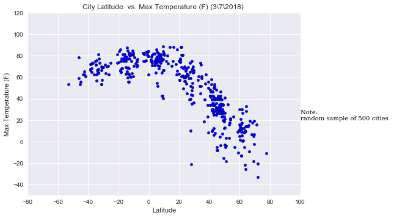
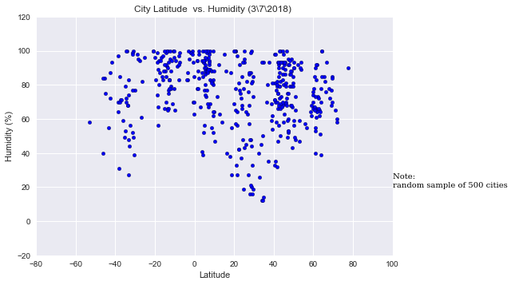
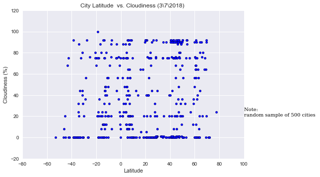
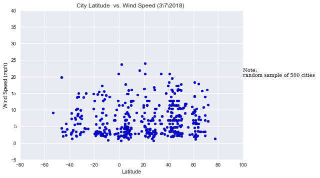

```python
import sys
sys.version
import platform
print(platform.python_version())
```

    3.6.4
    


```python
# Dependencies
import requests
import json
import pandas as pd
import numpy as np

import random 

import matplotlib.pyplot as plt

from config import api_key
from citipy import citipy

```


```python
#sample tried citipy 
city = citipy.nearest_city(33.567,-117.72)
cityname= city.city_name
cityname
```


    'laguna woods'


```python
#generate city list 

#randomly picking the co ordinates of lat, lon 
#creating a citi list as df
lat_ = np.arange(-100,100,10)
lon_ = np.arange(-100,100,10)

citi_df = pd.DataFrame()

citi_df["Latitude"] = ""
citi_df["Longitude"] = ""

#2 loop i j for lat lon
for i in lat_:
    #print(i)
    for j in lon_:
        #print(j)
        #list random 
        i_listval = list(np.arange(i, i+10, 0.2))
        j_listval = list(np.arange(j,j+10, 0.2))
        #print(j_listval) 
        #random sample selection  
        lat_1 = random.sample(i_listval, 50)
        lon_1 = random.sample(j_listval, 50)
        latsample = [(i+loc_lat) for loc_lat in lat_1]
        lonsample = [(j+loc_lon) for loc_lon in lon_1]
        
        #adding lat lon to df
        citi_df = citi_df.append(pd.DataFrame.from_dict({"Latitude": latsample, "Longitude" : lonsample}))
citi_df = citi_df.reset_index(drop=True)

#choose cities near by to the coordinates
citi_df["citiname"] = ""
for index, row in citi_df.iterrows():
    city = citipy.nearest_city(row["Latitude"], row["Longitude"])
    citi_df.set_value(index, "citiname", city.city_name)
 

    
```

    C:\Users\neelaJ\AppData\Local\conda\conda\envs\PythonData2\lib\site-packages\ipykernel\__main__.py:36: FutureWarning: set_value is deprecated and will be removed in a future release. Please use .at[] or .iat[] accessors instead
    


```python
#drop duplicate citi and lan log column
#select random 500 cities near to equator

newciti_df = citi_df.drop(["Latitude", "Longitude"], axis=1)
newciti_df = newciti_df.drop_duplicates()
selectcities = newciti_df.sample(500)
selectcities = selectcities.reset_index(drop=True)

```


```python
selectcities.iloc[1]
#count of records 
selectcities.shape

```


    (500, 1)


```python
#weather map url
url = "http://api.openweathermap.org/data/2.5/weather?"
units = "imperial"

c= 0
print("Begining of Data Retrival")
print(25*"-")
for index, row in selectcities.iterrows():
    c= c+1
    print(row["citiname"])
    query_url = f"{url}appid={api_key}&q={row['citiname']}&units={units}"
    print(f"Processing record: {c} of set | {row['citiname']} \n{query_url}")
    weather_response = requests.get(query_url)
    weather_json = weather_response.json()
    selectcities.set_value(index, "Latitude", weather_json.get("coord",{}).get("lat"))
    selectcities.set_value(index, "Longitude", weather_json.get("coord",{}).get("lon"))
    selectcities.set_value(index, "Temperature",weather_json.get("main",{}).get("temp_max"))
    selectcities.set_value(index, "WindSpeed", weather_json.get("wind",{}).get("speed"))
    selectcities.set_value(index, "Cloudiess", weather_json.get("clouds",{}).get("all"))
    selectcities.set_value(index,"Humidity", weather_json.get("main",{}).get("humidity"))

#sample printed to retrive the info 
print(weather_json)

print(25*"-")
print("Data Retrival complete")
print(25*"-")

selectcities
```

    Begining of Data Retrival
    -------------------------
    longavi
    Processing record: 1 of set | longavi 
    http://api.openweathermap.org/data/2.5/weather?appid=0897f22cc4804be6811cd4b6e58c4cfd&q=longavi&units=imperial
    

    C:\Users\neelaJ\AppData\Local\conda\conda\envs\PythonData2\lib\site-packages\ipykernel\__main__.py:15: FutureWarning: set_value is deprecated and will be removed in a future release. Please use .at[] or .iat[] accessors instead
    C:\Users\neelaJ\AppData\Local\conda\conda\envs\PythonData2\lib\site-packages\ipykernel\__main__.py:16: FutureWarning: set_value is deprecated and will be removed in a future release. Please use .at[] or .iat[] accessors instead
    C:\Users\neelaJ\AppData\Local\conda\conda\envs\PythonData2\lib\site-packages\ipykernel\__main__.py:17: FutureWarning: set_value is deprecated and will be removed in a future release. Please use .at[] or .iat[] accessors instead
    C:\Users\neelaJ\AppData\Local\conda\conda\envs\PythonData2\lib\site-packages\ipykernel\__main__.py:18: FutureWarning: set_value is deprecated and will be removed in a future release. Please use .at[] or .iat[] accessors instead
    C:\Users\neelaJ\AppData\Local\conda\conda\envs\PythonData2\lib\site-packages\ipykernel\__main__.py:19: FutureWarning: set_value is deprecated and will be removed in a future release. Please use .at[] or .iat[] accessors instead
    C:\Users\neelaJ\AppData\Local\conda\conda\envs\PythonData2\lib\site-packages\ipykernel\__main__.py:20: FutureWarning: set_value is deprecated and will be removed in a future release. Please use .at[] or .iat[] accessors instead
    

    huangnihe
    Processing record: 2 of set | huangnihe 
    http://api.openweathermap.org/data/2.5/weather?appid=0897f22cc4804be6811cd4b6e58c4cfd&q=huangnihe&units=imperial
    oparino
    Processing record: 3 of set | oparino 
    http://api.openweathermap.org/data/2.5/weather?appid=0897f22cc4804be6811cd4b6e58c4cfd&q=oparino&units=imperial
    graneros
    Processing record: 4 of set | graneros 
    http://api.openweathermap.org/data/2.5/weather?appid=0897f22cc4804be6811cd4b6e58c4cfd&q=graneros&units=imperial
    riachao do jacuipe
    Processing record: 5 of set | riachao do jacuipe 
    http://api.openweathermap.org/data/2.5/weather?appid=0897f22cc4804be6811cd4b6e58c4cfd&q=riachao do jacuipe&units=imperial
    kota tinggi
    Processing record: 6 of set | kota tinggi 
    http://api.openweathermap.org/data/2.5/weather?appid=0897f22cc4804be6811cd4b6e58c4cfd&q=kota tinggi&units=imperial
    tateyama
    Processing record: 7 of set | tateyama 
    http://api.openweathermap.org/data/2.5/weather?appid=0897f22cc4804be6811cd4b6e58c4cfd&q=tateyama&units=imperial
    amalfi
    Processing record: 8 of set | amalfi 
    http://api.openweathermap.org/data/2.5/weather?appid=0897f22cc4804be6811cd4b6e58c4cfd&q=amalfi&units=imperial
    kargasok
    Processing record: 9 of set | kargasok 
    http://api.openweathermap.org/data/2.5/weather?appid=0897f22cc4804be6811cd4b6e58c4cfd&q=kargasok&units=imperial
    kailua
    Processing record: 10 of set | kailua 
    http://api.openweathermap.org/data/2.5/weather?appid=0897f22cc4804be6811cd4b6e58c4cfd&q=kailua&units=imperial
    beldanga
    Processing record: 11 of set | beldanga 
    http://api.openweathermap.org/data/2.5/weather?appid=0897f22cc4804be6811cd4b6e58c4cfd&q=beldanga&units=imperial
    nguiu
    Processing record: 12 of set | nguiu 
    http://api.openweathermap.org/data/2.5/weather?appid=0897f22cc4804be6811cd4b6e58c4cfd&q=nguiu&units=imperial
    baracoa
    Processing record: 13 of set | baracoa 
    http://api.openweathermap.org/data/2.5/weather?appid=0897f22cc4804be6811cd4b6e58c4cfd&q=baracoa&units=imperial
    fagernes
    Processing record: 14 of set | fagernes 
    http://api.openweathermap.org/data/2.5/weather?appid=0897f22cc4804be6811cd4b6e58c4cfd&q=fagernes&units=imperial
    lorengau
    Processing record: 15 of set | lorengau 
    http://api.openweathermap.org/data/2.5/weather?appid=0897f22cc4804be6811cd4b6e58c4cfd&q=lorengau&units=imperial
    songkhla
    Processing record: 16 of set | songkhla 
    http://api.openweathermap.org/data/2.5/weather?appid=0897f22cc4804be6811cd4b6e58c4cfd&q=songkhla&units=imperial
    rodez
    Processing record: 17 of set | rodez 
    http://api.openweathermap.org/data/2.5/weather?appid=0897f22cc4804be6811cd4b6e58c4cfd&q=rodez&units=imperial
    bedesa
    Processing record: 18 of set | bedesa 
    http://api.openweathermap.org/data/2.5/weather?appid=0897f22cc4804be6811cd4b6e58c4cfd&q=bedesa&units=imperial
    chandbali
    Processing record: 19 of set | chandbali 
    http://api.openweathermap.org/data/2.5/weather?appid=0897f22cc4804be6811cd4b6e58c4cfd&q=chandbali&units=imperial
    shitanjing
    Processing record: 20 of set | shitanjing 
    http://api.openweathermap.org/data/2.5/weather?appid=0897f22cc4804be6811cd4b6e58c4cfd&q=shitanjing&units=imperial
    boueni
    Processing record: 21 of set | boueni 
    http://api.openweathermap.org/data/2.5/weather?appid=0897f22cc4804be6811cd4b6e58c4cfd&q=boueni&units=imperial
    shizunai
    Processing record: 22 of set | shizunai 
    http://api.openweathermap.org/data/2.5/weather?appid=0897f22cc4804be6811cd4b6e58c4cfd&q=shizunai&units=imperial
    shenkursk
    Processing record: 23 of set | shenkursk 
    http://api.openweathermap.org/data/2.5/weather?appid=0897f22cc4804be6811cd4b6e58c4cfd&q=shenkursk&units=imperial
    lapua
    Processing record: 24 of set | lapua 
    http://api.openweathermap.org/data/2.5/weather?appid=0897f22cc4804be6811cd4b6e58c4cfd&q=lapua&units=imperial
    mocambique
    Processing record: 25 of set | mocambique 
    http://api.openweathermap.org/data/2.5/weather?appid=0897f22cc4804be6811cd4b6e58c4cfd&q=mocambique&units=imperial
    autun
    Processing record: 26 of set | autun 
    http://api.openweathermap.org/data/2.5/weather?appid=0897f22cc4804be6811cd4b6e58c4cfd&q=autun&units=imperial
    necochea
    Processing record: 27 of set | necochea 
    http://api.openweathermap.org/data/2.5/weather?appid=0897f22cc4804be6811cd4b6e58c4cfd&q=necochea&units=imperial
    toamasina
    Processing record: 28 of set | toamasina 
    http://api.openweathermap.org/data/2.5/weather?appid=0897f22cc4804be6811cd4b6e58c4cfd&q=toamasina&units=imperial
    tolaga bay
    Processing record: 29 of set | tolaga bay 
    http://api.openweathermap.org/data/2.5/weather?appid=0897f22cc4804be6811cd4b6e58c4cfd&q=tolaga bay&units=imperial
    bangassou
    Processing record: 30 of set | bangassou 
    http://api.openweathermap.org/data/2.5/weather?appid=0897f22cc4804be6811cd4b6e58c4cfd&q=bangassou&units=imperial
    qianguo
    Processing record: 31 of set | qianguo 
    http://api.openweathermap.org/data/2.5/weather?appid=0897f22cc4804be6811cd4b6e58c4cfd&q=qianguo&units=imperial
    svetlyy
    Processing record: 32 of set | svetlyy 
    http://api.openweathermap.org/data/2.5/weather?appid=0897f22cc4804be6811cd4b6e58c4cfd&q=svetlyy&units=imperial
    queenstown
    Processing record: 33 of set | queenstown 
    http://api.openweathermap.org/data/2.5/weather?appid=0897f22cc4804be6811cd4b6e58c4cfd&q=queenstown&units=imperial
    pangai
    Processing record: 34 of set | pangai 
    http://api.openweathermap.org/data/2.5/weather?appid=0897f22cc4804be6811cd4b6e58c4cfd&q=pangai&units=imperial
    puerto leguizamo
    Processing record: 35 of set | puerto leguizamo 
    http://api.openweathermap.org/data/2.5/weather?appid=0897f22cc4804be6811cd4b6e58c4cfd&q=puerto leguizamo&units=imperial
    devils lake
    Processing record: 36 of set | devils lake 
    http://api.openweathermap.org/data/2.5/weather?appid=0897f22cc4804be6811cd4b6e58c4cfd&q=devils lake&units=imperial
    jaque
    Processing record: 37 of set | jaque 
    http://api.openweathermap.org/data/2.5/weather?appid=0897f22cc4804be6811cd4b6e58c4cfd&q=jaque&units=imperial
    paracuru
    Processing record: 38 of set | paracuru 
    http://api.openweathermap.org/data/2.5/weather?appid=0897f22cc4804be6811cd4b6e58c4cfd&q=paracuru&units=imperial
    galle
    Processing record: 39 of set | galle 
    http://api.openweathermap.org/data/2.5/weather?appid=0897f22cc4804be6811cd4b6e58c4cfd&q=galle&units=imperial
    clarence town
    Processing record: 40 of set | clarence town 
    http://api.openweathermap.org/data/2.5/weather?appid=0897f22cc4804be6811cd4b6e58c4cfd&q=clarence town&units=imperial
    tsiroanomandidy
    Processing record: 41 of set | tsiroanomandidy 
    http://api.openweathermap.org/data/2.5/weather?appid=0897f22cc4804be6811cd4b6e58c4cfd&q=tsiroanomandidy&units=imperial
    nurota
    Processing record: 42 of set | nurota 
    http://api.openweathermap.org/data/2.5/weather?appid=0897f22cc4804be6811cd4b6e58c4cfd&q=nurota&units=imperial
    suhindol
    Processing record: 43 of set | suhindol 
    http://api.openweathermap.org/data/2.5/weather?appid=0897f22cc4804be6811cd4b6e58c4cfd&q=suhindol&units=imperial
    remedios
    Processing record: 44 of set | remedios 
    http://api.openweathermap.org/data/2.5/weather?appid=0897f22cc4804be6811cd4b6e58c4cfd&q=remedios&units=imperial
    marawi
    Processing record: 45 of set | marawi 
    http://api.openweathermap.org/data/2.5/weather?appid=0897f22cc4804be6811cd4b6e58c4cfd&q=marawi&units=imperial
    barentsburg
    Processing record: 46 of set | barentsburg 
    http://api.openweathermap.org/data/2.5/weather?appid=0897f22cc4804be6811cd4b6e58c4cfd&q=barentsburg&units=imperial
    kondinskoye
    Processing record: 47 of set | kondinskoye 
    http://api.openweathermap.org/data/2.5/weather?appid=0897f22cc4804be6811cd4b6e58c4cfd&q=kondinskoye&units=imperial
    gogrial
    Processing record: 48 of set | gogrial 
    http://api.openweathermap.org/data/2.5/weather?appid=0897f22cc4804be6811cd4b6e58c4cfd&q=gogrial&units=imperial
    piacabucu
    Processing record: 49 of set | piacabucu 
    http://api.openweathermap.org/data/2.5/weather?appid=0897f22cc4804be6811cd4b6e58c4cfd&q=piacabucu&units=imperial
    chirongui
    Processing record: 50 of set | chirongui 
    http://api.openweathermap.org/data/2.5/weather?appid=0897f22cc4804be6811cd4b6e58c4cfd&q=chirongui&units=imperial
    qaanaaq
    Processing record: 51 of set | qaanaaq 
    http://api.openweathermap.org/data/2.5/weather?appid=0897f22cc4804be6811cd4b6e58c4cfd&q=qaanaaq&units=imperial
    padampur
    Processing record: 52 of set | padampur 
    http://api.openweathermap.org/data/2.5/weather?appid=0897f22cc4804be6811cd4b6e58c4cfd&q=padampur&units=imperial
    katima mulilo
    Processing record: 53 of set | katima mulilo 
    http://api.openweathermap.org/data/2.5/weather?appid=0897f22cc4804be6811cd4b6e58c4cfd&q=katima mulilo&units=imperial
    kuloy
    Processing record: 54 of set | kuloy 
    http://api.openweathermap.org/data/2.5/weather?appid=0897f22cc4804be6811cd4b6e58c4cfd&q=kuloy&units=imperial
    gurjaani
    Processing record: 55 of set | gurjaani 
    http://api.openweathermap.org/data/2.5/weather?appid=0897f22cc4804be6811cd4b6e58c4cfd&q=gurjaani&units=imperial
    artyk
    Processing record: 56 of set | artyk 
    http://api.openweathermap.org/data/2.5/weather?appid=0897f22cc4804be6811cd4b6e58c4cfd&q=artyk&units=imperial
    urcos
    Processing record: 57 of set | urcos 
    http://api.openweathermap.org/data/2.5/weather?appid=0897f22cc4804be6811cd4b6e58c4cfd&q=urcos&units=imperial
    forbes
    Processing record: 58 of set | forbes 
    http://api.openweathermap.org/data/2.5/weather?appid=0897f22cc4804be6811cd4b6e58c4cfd&q=forbes&units=imperial
    basoko
    Processing record: 59 of set | basoko 
    http://api.openweathermap.org/data/2.5/weather?appid=0897f22cc4804be6811cd4b6e58c4cfd&q=basoko&units=imperial
    ambanja
    Processing record: 60 of set | ambanja 
    http://api.openweathermap.org/data/2.5/weather?appid=0897f22cc4804be6811cd4b6e58c4cfd&q=ambanja&units=imperial
    mandera
    Processing record: 61 of set | mandera 
    http://api.openweathermap.org/data/2.5/weather?appid=0897f22cc4804be6811cd4b6e58c4cfd&q=mandera&units=imperial
    kapiri mposhi
    Processing record: 62 of set | kapiri mposhi 
    http://api.openweathermap.org/data/2.5/weather?appid=0897f22cc4804be6811cd4b6e58c4cfd&q=kapiri mposhi&units=imperial
    dombarovskiy
    Processing record: 63 of set | dombarovskiy 
    http://api.openweathermap.org/data/2.5/weather?appid=0897f22cc4804be6811cd4b6e58c4cfd&q=dombarovskiy&units=imperial
    miramar
    Processing record: 64 of set | miramar 
    http://api.openweathermap.org/data/2.5/weather?appid=0897f22cc4804be6811cd4b6e58c4cfd&q=miramar&units=imperial
    san luis
    Processing record: 65 of set | san luis 
    http://api.openweathermap.org/data/2.5/weather?appid=0897f22cc4804be6811cd4b6e58c4cfd&q=san luis&units=imperial
    kursavka
    Processing record: 66 of set | kursavka 
    http://api.openweathermap.org/data/2.5/weather?appid=0897f22cc4804be6811cd4b6e58c4cfd&q=kursavka&units=imperial
    garowe
    Processing record: 67 of set | garowe 
    http://api.openweathermap.org/data/2.5/weather?appid=0897f22cc4804be6811cd4b6e58c4cfd&q=garowe&units=imperial
    wulanhaote
    Processing record: 68 of set | wulanhaote 
    http://api.openweathermap.org/data/2.5/weather?appid=0897f22cc4804be6811cd4b6e58c4cfd&q=wulanhaote&units=imperial
    cidreira
    Processing record: 69 of set | cidreira 
    http://api.openweathermap.org/data/2.5/weather?appid=0897f22cc4804be6811cd4b6e58c4cfd&q=cidreira&units=imperial
    boa vista
    Processing record: 70 of set | boa vista 
    http://api.openweathermap.org/data/2.5/weather?appid=0897f22cc4804be6811cd4b6e58c4cfd&q=boa vista&units=imperial
    luanshya
    Processing record: 71 of set | luanshya 
    http://api.openweathermap.org/data/2.5/weather?appid=0897f22cc4804be6811cd4b6e58c4cfd&q=luanshya&units=imperial
    snezhnogorsk
    Processing record: 72 of set | snezhnogorsk 
    http://api.openweathermap.org/data/2.5/weather?appid=0897f22cc4804be6811cd4b6e58c4cfd&q=snezhnogorsk&units=imperial
    bayan
    Processing record: 73 of set | bayan 
    http://api.openweathermap.org/data/2.5/weather?appid=0897f22cc4804be6811cd4b6e58c4cfd&q=bayan&units=imperial
    san antonio
    Processing record: 74 of set | san antonio 
    http://api.openweathermap.org/data/2.5/weather?appid=0897f22cc4804be6811cd4b6e58c4cfd&q=san antonio&units=imperial
    jijiga
    Processing record: 75 of set | jijiga 
    http://api.openweathermap.org/data/2.5/weather?appid=0897f22cc4804be6811cd4b6e58c4cfd&q=jijiga&units=imperial
    abnub
    Processing record: 76 of set | abnub 
    http://api.openweathermap.org/data/2.5/weather?appid=0897f22cc4804be6811cd4b6e58c4cfd&q=abnub&units=imperial
    ilesha
    Processing record: 77 of set | ilesha 
    http://api.openweathermap.org/data/2.5/weather?appid=0897f22cc4804be6811cd4b6e58c4cfd&q=ilesha&units=imperial
    caibarien
    Processing record: 78 of set | caibarien 
    http://api.openweathermap.org/data/2.5/weather?appid=0897f22cc4804be6811cd4b6e58c4cfd&q=caibarien&units=imperial
    colesberg
    Processing record: 79 of set | colesberg 
    http://api.openweathermap.org/data/2.5/weather?appid=0897f22cc4804be6811cd4b6e58c4cfd&q=colesberg&units=imperial
    carman
    Processing record: 80 of set | carman 
    http://api.openweathermap.org/data/2.5/weather?appid=0897f22cc4804be6811cd4b6e58c4cfd&q=carman&units=imperial
    richards bay
    Processing record: 81 of set | richards bay 
    http://api.openweathermap.org/data/2.5/weather?appid=0897f22cc4804be6811cd4b6e58c4cfd&q=richards bay&units=imperial
    hokitika
    Processing record: 82 of set | hokitika 
    http://api.openweathermap.org/data/2.5/weather?appid=0897f22cc4804be6811cd4b6e58c4cfd&q=hokitika&units=imperial
    panzhihua
    Processing record: 83 of set | panzhihua 
    http://api.openweathermap.org/data/2.5/weather?appid=0897f22cc4804be6811cd4b6e58c4cfd&q=panzhihua&units=imperial
    storm lake
    Processing record: 84 of set | storm lake 
    http://api.openweathermap.org/data/2.5/weather?appid=0897f22cc4804be6811cd4b6e58c4cfd&q=storm lake&units=imperial
    tortosa
    Processing record: 85 of set | tortosa 
    http://api.openweathermap.org/data/2.5/weather?appid=0897f22cc4804be6811cd4b6e58c4cfd&q=tortosa&units=imperial
    san vicente de canete
    Processing record: 86 of set | san vicente de canete 
    http://api.openweathermap.org/data/2.5/weather?appid=0897f22cc4804be6811cd4b6e58c4cfd&q=san vicente de canete&units=imperial
    ontario
    Processing record: 87 of set | ontario 
    http://api.openweathermap.org/data/2.5/weather?appid=0897f22cc4804be6811cd4b6e58c4cfd&q=ontario&units=imperial
    teluk intan
    Processing record: 88 of set | teluk intan 
    http://api.openweathermap.org/data/2.5/weather?appid=0897f22cc4804be6811cd4b6e58c4cfd&q=teluk intan&units=imperial
    osmena
    Processing record: 89 of set | osmena 
    http://api.openweathermap.org/data/2.5/weather?appid=0897f22cc4804be6811cd4b6e58c4cfd&q=osmena&units=imperial
    chilca
    Processing record: 90 of set | chilca 
    http://api.openweathermap.org/data/2.5/weather?appid=0897f22cc4804be6811cd4b6e58c4cfd&q=chilca&units=imperial
    quarai
    Processing record: 91 of set | quarai 
    http://api.openweathermap.org/data/2.5/weather?appid=0897f22cc4804be6811cd4b6e58c4cfd&q=quarai&units=imperial
    qianan
    Processing record: 92 of set | qianan 
    http://api.openweathermap.org/data/2.5/weather?appid=0897f22cc4804be6811cd4b6e58c4cfd&q=qianan&units=imperial
    kuche
    Processing record: 93 of set | kuche 
    http://api.openweathermap.org/data/2.5/weather?appid=0897f22cc4804be6811cd4b6e58c4cfd&q=kuche&units=imperial
    celestun
    Processing record: 94 of set | celestun 
    http://api.openweathermap.org/data/2.5/weather?appid=0897f22cc4804be6811cd4b6e58c4cfd&q=celestun&units=imperial
    cayenne
    Processing record: 95 of set | cayenne 
    http://api.openweathermap.org/data/2.5/weather?appid=0897f22cc4804be6811cd4b6e58c4cfd&q=cayenne&units=imperial
    karpogory
    Processing record: 96 of set | karpogory 
    http://api.openweathermap.org/data/2.5/weather?appid=0897f22cc4804be6811cd4b6e58c4cfd&q=karpogory&units=imperial
    makubetsu
    Processing record: 97 of set | makubetsu 
    http://api.openweathermap.org/data/2.5/weather?appid=0897f22cc4804be6811cd4b6e58c4cfd&q=makubetsu&units=imperial
    ambovombe
    Processing record: 98 of set | ambovombe 
    http://api.openweathermap.org/data/2.5/weather?appid=0897f22cc4804be6811cd4b6e58c4cfd&q=ambovombe&units=imperial
    te anau
    Processing record: 99 of set | te anau 
    http://api.openweathermap.org/data/2.5/weather?appid=0897f22cc4804be6811cd4b6e58c4cfd&q=te anau&units=imperial
    vila franca do campo
    Processing record: 100 of set | vila franca do campo 
    http://api.openweathermap.org/data/2.5/weather?appid=0897f22cc4804be6811cd4b6e58c4cfd&q=vila franca do campo&units=imperial
    bredasdorp
    Processing record: 101 of set | bredasdorp 
    http://api.openweathermap.org/data/2.5/weather?appid=0897f22cc4804be6811cd4b6e58c4cfd&q=bredasdorp&units=imperial
    saint george
    Processing record: 102 of set | saint george 
    http://api.openweathermap.org/data/2.5/weather?appid=0897f22cc4804be6811cd4b6e58c4cfd&q=saint george&units=imperial
    jaciara
    Processing record: 103 of set | jaciara 
    http://api.openweathermap.org/data/2.5/weather?appid=0897f22cc4804be6811cd4b6e58c4cfd&q=jaciara&units=imperial
    trincomalee
    Processing record: 104 of set | trincomalee 
    http://api.openweathermap.org/data/2.5/weather?appid=0897f22cc4804be6811cd4b6e58c4cfd&q=trincomalee&units=imperial
    jerome
    Processing record: 105 of set | jerome 
    http://api.openweathermap.org/data/2.5/weather?appid=0897f22cc4804be6811cd4b6e58c4cfd&q=jerome&units=imperial
    treinta y tres
    Processing record: 106 of set | treinta y tres 
    http://api.openweathermap.org/data/2.5/weather?appid=0897f22cc4804be6811cd4b6e58c4cfd&q=treinta y tres&units=imperial
    afua
    Processing record: 107 of set | afua 
    http://api.openweathermap.org/data/2.5/weather?appid=0897f22cc4804be6811cd4b6e58c4cfd&q=afua&units=imperial
    ambodifototra
    Processing record: 108 of set | ambodifototra 
    http://api.openweathermap.org/data/2.5/weather?appid=0897f22cc4804be6811cd4b6e58c4cfd&q=ambodifototra&units=imperial
    sao miguel do araguaia
    Processing record: 109 of set | sao miguel do araguaia 
    http://api.openweathermap.org/data/2.5/weather?appid=0897f22cc4804be6811cd4b6e58c4cfd&q=sao miguel do araguaia&units=imperial
    kahului
    Processing record: 110 of set | kahului 
    http://api.openweathermap.org/data/2.5/weather?appid=0897f22cc4804be6811cd4b6e58c4cfd&q=kahului&units=imperial
    fergus falls
    Processing record: 111 of set | fergus falls 
    http://api.openweathermap.org/data/2.5/weather?appid=0897f22cc4804be6811cd4b6e58c4cfd&q=fergus falls&units=imperial
    huaura
    Processing record: 112 of set | huaura 
    http://api.openweathermap.org/data/2.5/weather?appid=0897f22cc4804be6811cd4b6e58c4cfd&q=huaura&units=imperial
    chhukha
    Processing record: 113 of set | chhukha 
    http://api.openweathermap.org/data/2.5/weather?appid=0897f22cc4804be6811cd4b6e58c4cfd&q=chhukha&units=imperial
    padang
    Processing record: 114 of set | padang 
    http://api.openweathermap.org/data/2.5/weather?appid=0897f22cc4804be6811cd4b6e58c4cfd&q=padang&units=imperial
    hulan
    Processing record: 115 of set | hulan 
    http://api.openweathermap.org/data/2.5/weather?appid=0897f22cc4804be6811cd4b6e58c4cfd&q=hulan&units=imperial
    naukot
    Processing record: 116 of set | naukot 
    http://api.openweathermap.org/data/2.5/weather?appid=0897f22cc4804be6811cd4b6e58c4cfd&q=naukot&units=imperial
    olden
    Processing record: 117 of set | olden 
    http://api.openweathermap.org/data/2.5/weather?appid=0897f22cc4804be6811cd4b6e58c4cfd&q=olden&units=imperial
    vossevangen
    Processing record: 118 of set | vossevangen 
    http://api.openweathermap.org/data/2.5/weather?appid=0897f22cc4804be6811cd4b6e58c4cfd&q=vossevangen&units=imperial
    frontera
    Processing record: 119 of set | frontera 
    http://api.openweathermap.org/data/2.5/weather?appid=0897f22cc4804be6811cd4b6e58c4cfd&q=frontera&units=imperial
    gasa
    Processing record: 120 of set | gasa 
    http://api.openweathermap.org/data/2.5/weather?appid=0897f22cc4804be6811cd4b6e58c4cfd&q=gasa&units=imperial
    banjar
    Processing record: 121 of set | banjar 
    http://api.openweathermap.org/data/2.5/weather?appid=0897f22cc4804be6811cd4b6e58c4cfd&q=banjar&units=imperial
    saint-georges
    Processing record: 122 of set | saint-georges 
    http://api.openweathermap.org/data/2.5/weather?appid=0897f22cc4804be6811cd4b6e58c4cfd&q=saint-georges&units=imperial
    belaya rechka
    Processing record: 123 of set | belaya rechka 
    http://api.openweathermap.org/data/2.5/weather?appid=0897f22cc4804be6811cd4b6e58c4cfd&q=belaya rechka&units=imperial
    waingapu
    Processing record: 124 of set | waingapu 
    http://api.openweathermap.org/data/2.5/weather?appid=0897f22cc4804be6811cd4b6e58c4cfd&q=waingapu&units=imperial
    le mars
    Processing record: 125 of set | le mars 
    http://api.openweathermap.org/data/2.5/weather?appid=0897f22cc4804be6811cd4b6e58c4cfd&q=le mars&units=imperial
    matagami
    Processing record: 126 of set | matagami 
    http://api.openweathermap.org/data/2.5/weather?appid=0897f22cc4804be6811cd4b6e58c4cfd&q=matagami&units=imperial
    los andes
    Processing record: 127 of set | los andes 
    http://api.openweathermap.org/data/2.5/weather?appid=0897f22cc4804be6811cd4b6e58c4cfd&q=los andes&units=imperial
    sovetskaya
    Processing record: 128 of set | sovetskaya 
    http://api.openweathermap.org/data/2.5/weather?appid=0897f22cc4804be6811cd4b6e58c4cfd&q=sovetskaya&units=imperial
    andevoranto
    Processing record: 129 of set | andevoranto 
    http://api.openweathermap.org/data/2.5/weather?appid=0897f22cc4804be6811cd4b6e58c4cfd&q=andevoranto&units=imperial
    labuhan
    Processing record: 130 of set | labuhan 
    http://api.openweathermap.org/data/2.5/weather?appid=0897f22cc4804be6811cd4b6e58c4cfd&q=labuhan&units=imperial
    kemijarvi
    Processing record: 131 of set | kemijarvi 
    http://api.openweathermap.org/data/2.5/weather?appid=0897f22cc4804be6811cd4b6e58c4cfd&q=kemijarvi&units=imperial
    samarai
    Processing record: 132 of set | samarai 
    http://api.openweathermap.org/data/2.5/weather?appid=0897f22cc4804be6811cd4b6e58c4cfd&q=samarai&units=imperial
    hihifo
    Processing record: 133 of set | hihifo 
    http://api.openweathermap.org/data/2.5/weather?appid=0897f22cc4804be6811cd4b6e58c4cfd&q=hihifo&units=imperial
    dom pedrito
    Processing record: 134 of set | dom pedrito 
    http://api.openweathermap.org/data/2.5/weather?appid=0897f22cc4804be6811cd4b6e58c4cfd&q=dom pedrito&units=imperial
    montevideo
    Processing record: 135 of set | montevideo 
    http://api.openweathermap.org/data/2.5/weather?appid=0897f22cc4804be6811cd4b6e58c4cfd&q=montevideo&units=imperial
    fomboni
    Processing record: 136 of set | fomboni 
    http://api.openweathermap.org/data/2.5/weather?appid=0897f22cc4804be6811cd4b6e58c4cfd&q=fomboni&units=imperial
    kamenskoye
    Processing record: 137 of set | kamenskoye 
    http://api.openweathermap.org/data/2.5/weather?appid=0897f22cc4804be6811cd4b6e58c4cfd&q=kamenskoye&units=imperial
    ylojarvi
    Processing record: 138 of set | ylojarvi 
    http://api.openweathermap.org/data/2.5/weather?appid=0897f22cc4804be6811cd4b6e58c4cfd&q=ylojarvi&units=imperial
    moengo
    Processing record: 139 of set | moengo 
    http://api.openweathermap.org/data/2.5/weather?appid=0897f22cc4804be6811cd4b6e58c4cfd&q=moengo&units=imperial
    champerico
    Processing record: 140 of set | champerico 
    http://api.openweathermap.org/data/2.5/weather?appid=0897f22cc4804be6811cd4b6e58c4cfd&q=champerico&units=imperial
    rafai
    Processing record: 141 of set | rafai 
    http://api.openweathermap.org/data/2.5/weather?appid=0897f22cc4804be6811cd4b6e58c4cfd&q=rafai&units=imperial
    hare bay
    Processing record: 142 of set | hare bay 
    http://api.openweathermap.org/data/2.5/weather?appid=0897f22cc4804be6811cd4b6e58c4cfd&q=hare bay&units=imperial
    son la
    Processing record: 143 of set | son la 
    http://api.openweathermap.org/data/2.5/weather?appid=0897f22cc4804be6811cd4b6e58c4cfd&q=son la&units=imperial
    ovejas
    Processing record: 144 of set | ovejas 
    http://api.openweathermap.org/data/2.5/weather?appid=0897f22cc4804be6811cd4b6e58c4cfd&q=ovejas&units=imperial
    shanhetun
    Processing record: 145 of set | shanhetun 
    http://api.openweathermap.org/data/2.5/weather?appid=0897f22cc4804be6811cd4b6e58c4cfd&q=shanhetun&units=imperial
    abbeville
    Processing record: 146 of set | abbeville 
    http://api.openweathermap.org/data/2.5/weather?appid=0897f22cc4804be6811cd4b6e58c4cfd&q=abbeville&units=imperial
    iwanai
    Processing record: 147 of set | iwanai 
    http://api.openweathermap.org/data/2.5/weather?appid=0897f22cc4804be6811cd4b6e58c4cfd&q=iwanai&units=imperial
    bolila
    Processing record: 148 of set | bolila 
    http://api.openweathermap.org/data/2.5/weather?appid=0897f22cc4804be6811cd4b6e58c4cfd&q=bolila&units=imperial
    chaumont
    Processing record: 149 of set | chaumont 
    http://api.openweathermap.org/data/2.5/weather?appid=0897f22cc4804be6811cd4b6e58c4cfd&q=chaumont&units=imperial
    peniche
    Processing record: 150 of set | peniche 
    http://api.openweathermap.org/data/2.5/weather?appid=0897f22cc4804be6811cd4b6e58c4cfd&q=peniche&units=imperial
    pisco
    Processing record: 151 of set | pisco 
    http://api.openweathermap.org/data/2.5/weather?appid=0897f22cc4804be6811cd4b6e58c4cfd&q=pisco&units=imperial
    vagamo
    Processing record: 152 of set | vagamo 
    http://api.openweathermap.org/data/2.5/weather?appid=0897f22cc4804be6811cd4b6e58c4cfd&q=vagamo&units=imperial
    miraflores
    Processing record: 153 of set | miraflores 
    http://api.openweathermap.org/data/2.5/weather?appid=0897f22cc4804be6811cd4b6e58c4cfd&q=miraflores&units=imperial
    mangan
    Processing record: 154 of set | mangan 
    http://api.openweathermap.org/data/2.5/weather?appid=0897f22cc4804be6811cd4b6e58c4cfd&q=mangan&units=imperial
    haapu
    Processing record: 155 of set | haapu 
    http://api.openweathermap.org/data/2.5/weather?appid=0897f22cc4804be6811cd4b6e58c4cfd&q=haapu&units=imperial
    mosquera
    Processing record: 156 of set | mosquera 
    http://api.openweathermap.org/data/2.5/weather?appid=0897f22cc4804be6811cd4b6e58c4cfd&q=mosquera&units=imperial
    mirina
    Processing record: 157 of set | mirina 
    http://api.openweathermap.org/data/2.5/weather?appid=0897f22cc4804be6811cd4b6e58c4cfd&q=mirina&units=imperial
    oranjemund
    Processing record: 158 of set | oranjemund 
    http://api.openweathermap.org/data/2.5/weather?appid=0897f22cc4804be6811cd4b6e58c4cfd&q=oranjemund&units=imperial
    vanavara
    Processing record: 159 of set | vanavara 
    http://api.openweathermap.org/data/2.5/weather?appid=0897f22cc4804be6811cd4b6e58c4cfd&q=vanavara&units=imperial
    lakes entrance
    Processing record: 160 of set | lakes entrance 
    http://api.openweathermap.org/data/2.5/weather?appid=0897f22cc4804be6811cd4b6e58c4cfd&q=lakes entrance&units=imperial
    prainha
    Processing record: 161 of set | prainha 
    http://api.openweathermap.org/data/2.5/weather?appid=0897f22cc4804be6811cd4b6e58c4cfd&q=prainha&units=imperial
    wajir
    Processing record: 162 of set | wajir 
    http://api.openweathermap.org/data/2.5/weather?appid=0897f22cc4804be6811cd4b6e58c4cfd&q=wajir&units=imperial
    solwezi
    Processing record: 163 of set | solwezi 
    http://api.openweathermap.org/data/2.5/weather?appid=0897f22cc4804be6811cd4b6e58c4cfd&q=solwezi&units=imperial
    santa cruz del sur
    Processing record: 164 of set | santa cruz del sur 
    http://api.openweathermap.org/data/2.5/weather?appid=0897f22cc4804be6811cd4b6e58c4cfd&q=santa cruz del sur&units=imperial
    port keats
    Processing record: 165 of set | port keats 
    http://api.openweathermap.org/data/2.5/weather?appid=0897f22cc4804be6811cd4b6e58c4cfd&q=port keats&units=imperial
    guiratinga
    Processing record: 166 of set | guiratinga 
    http://api.openweathermap.org/data/2.5/weather?appid=0897f22cc4804be6811cd4b6e58c4cfd&q=guiratinga&units=imperial
    tanquian
    Processing record: 167 of set | tanquian 
    http://api.openweathermap.org/data/2.5/weather?appid=0897f22cc4804be6811cd4b6e58c4cfd&q=tanquian&units=imperial
    ituni
    Processing record: 168 of set | ituni 
    http://api.openweathermap.org/data/2.5/weather?appid=0897f22cc4804be6811cd4b6e58c4cfd&q=ituni&units=imperial
    port macquarie
    Processing record: 169 of set | port macquarie 
    http://api.openweathermap.org/data/2.5/weather?appid=0897f22cc4804be6811cd4b6e58c4cfd&q=port macquarie&units=imperial
    duluth
    Processing record: 170 of set | duluth 
    http://api.openweathermap.org/data/2.5/weather?appid=0897f22cc4804be6811cd4b6e58c4cfd&q=duluth&units=imperial
    noormarkku
    Processing record: 171 of set | noormarkku 
    http://api.openweathermap.org/data/2.5/weather?appid=0897f22cc4804be6811cd4b6e58c4cfd&q=noormarkku&units=imperial
    ust-koksa
    Processing record: 172 of set | ust-koksa 
    http://api.openweathermap.org/data/2.5/weather?appid=0897f22cc4804be6811cd4b6e58c4cfd&q=ust-koksa&units=imperial
    buqayq
    Processing record: 173 of set | buqayq 
    http://api.openweathermap.org/data/2.5/weather?appid=0897f22cc4804be6811cd4b6e58c4cfd&q=buqayq&units=imperial
    aquiraz
    Processing record: 174 of set | aquiraz 
    http://api.openweathermap.org/data/2.5/weather?appid=0897f22cc4804be6811cd4b6e58c4cfd&q=aquiraz&units=imperial
    tarrega
    Processing record: 175 of set | tarrega 
    http://api.openweathermap.org/data/2.5/weather?appid=0897f22cc4804be6811cd4b6e58c4cfd&q=tarrega&units=imperial
    nayoro
    Processing record: 176 of set | nayoro 
    http://api.openweathermap.org/data/2.5/weather?appid=0897f22cc4804be6811cd4b6e58c4cfd&q=nayoro&units=imperial
    boshnyakovo
    Processing record: 177 of set | boshnyakovo 
    http://api.openweathermap.org/data/2.5/weather?appid=0897f22cc4804be6811cd4b6e58c4cfd&q=boshnyakovo&units=imperial
    ardesen
    Processing record: 178 of set | ardesen 
    http://api.openweathermap.org/data/2.5/weather?appid=0897f22cc4804be6811cd4b6e58c4cfd&q=ardesen&units=imperial
    yomitan
    Processing record: 179 of set | yomitan 
    http://api.openweathermap.org/data/2.5/weather?appid=0897f22cc4804be6811cd4b6e58c4cfd&q=yomitan&units=imperial
    butterworth
    Processing record: 180 of set | butterworth 
    http://api.openweathermap.org/data/2.5/weather?appid=0897f22cc4804be6811cd4b6e58c4cfd&q=butterworth&units=imperial
    mar del plata
    Processing record: 181 of set | mar del plata 
    http://api.openweathermap.org/data/2.5/weather?appid=0897f22cc4804be6811cd4b6e58c4cfd&q=mar del plata&units=imperial
    luderitz
    Processing record: 182 of set | luderitz 
    http://api.openweathermap.org/data/2.5/weather?appid=0897f22cc4804be6811cd4b6e58c4cfd&q=luderitz&units=imperial
    daltenganj
    Processing record: 183 of set | daltenganj 
    http://api.openweathermap.org/data/2.5/weather?appid=0897f22cc4804be6811cd4b6e58c4cfd&q=daltenganj&units=imperial
    el bagre
    Processing record: 184 of set | el bagre 
    http://api.openweathermap.org/data/2.5/weather?appid=0897f22cc4804be6811cd4b6e58c4cfd&q=el bagre&units=imperial
    parana
    Processing record: 185 of set | parana 
    http://api.openweathermap.org/data/2.5/weather?appid=0897f22cc4804be6811cd4b6e58c4cfd&q=parana&units=imperial
    biak
    Processing record: 186 of set | biak 
    http://api.openweathermap.org/data/2.5/weather?appid=0897f22cc4804be6811cd4b6e58c4cfd&q=biak&units=imperial
    dalbandin
    Processing record: 187 of set | dalbandin 
    http://api.openweathermap.org/data/2.5/weather?appid=0897f22cc4804be6811cd4b6e58c4cfd&q=dalbandin&units=imperial
    fitchburg
    Processing record: 188 of set | fitchburg 
    http://api.openweathermap.org/data/2.5/weather?appid=0897f22cc4804be6811cd4b6e58c4cfd&q=fitchburg&units=imperial
    ararat
    Processing record: 189 of set | ararat 
    http://api.openweathermap.org/data/2.5/weather?appid=0897f22cc4804be6811cd4b6e58c4cfd&q=ararat&units=imperial
    saint-jerome
    Processing record: 190 of set | saint-jerome 
    http://api.openweathermap.org/data/2.5/weather?appid=0897f22cc4804be6811cd4b6e58c4cfd&q=saint-jerome&units=imperial
    provideniya
    Processing record: 191 of set | provideniya 
    http://api.openweathermap.org/data/2.5/weather?appid=0897f22cc4804be6811cd4b6e58c4cfd&q=provideniya&units=imperial
    kalomo
    Processing record: 192 of set | kalomo 
    http://api.openweathermap.org/data/2.5/weather?appid=0897f22cc4804be6811cd4b6e58c4cfd&q=kalomo&units=imperial
    corowa
    Processing record: 193 of set | corowa 
    http://api.openweathermap.org/data/2.5/weather?appid=0897f22cc4804be6811cd4b6e58c4cfd&q=corowa&units=imperial
    krasnoborsk
    Processing record: 194 of set | krasnoborsk 
    http://api.openweathermap.org/data/2.5/weather?appid=0897f22cc4804be6811cd4b6e58c4cfd&q=krasnoborsk&units=imperial
    yenagoa
    Processing record: 195 of set | yenagoa 
    http://api.openweathermap.org/data/2.5/weather?appid=0897f22cc4804be6811cd4b6e58c4cfd&q=yenagoa&units=imperial
    castlemaine
    Processing record: 196 of set | castlemaine 
    http://api.openweathermap.org/data/2.5/weather?appid=0897f22cc4804be6811cd4b6e58c4cfd&q=castlemaine&units=imperial
    vierzon
    Processing record: 197 of set | vierzon 
    http://api.openweathermap.org/data/2.5/weather?appid=0897f22cc4804be6811cd4b6e58c4cfd&q=vierzon&units=imperial
    wukari
    Processing record: 198 of set | wukari 
    http://api.openweathermap.org/data/2.5/weather?appid=0897f22cc4804be6811cd4b6e58c4cfd&q=wukari&units=imperial
    niagara falls
    Processing record: 199 of set | niagara falls 
    http://api.openweathermap.org/data/2.5/weather?appid=0897f22cc4804be6811cd4b6e58c4cfd&q=niagara falls&units=imperial
    iisalmi
    Processing record: 200 of set | iisalmi 
    http://api.openweathermap.org/data/2.5/weather?appid=0897f22cc4804be6811cd4b6e58c4cfd&q=iisalmi&units=imperial
    buenaventura
    Processing record: 201 of set | buenaventura 
    http://api.openweathermap.org/data/2.5/weather?appid=0897f22cc4804be6811cd4b6e58c4cfd&q=buenaventura&units=imperial
    columbus
    Processing record: 202 of set | columbus 
    http://api.openweathermap.org/data/2.5/weather?appid=0897f22cc4804be6811cd4b6e58c4cfd&q=columbus&units=imperial
    pitea
    Processing record: 203 of set | pitea 
    http://api.openweathermap.org/data/2.5/weather?appid=0897f22cc4804be6811cd4b6e58c4cfd&q=pitea&units=imperial
    emba
    Processing record: 204 of set | emba 
    http://api.openweathermap.org/data/2.5/weather?appid=0897f22cc4804be6811cd4b6e58c4cfd&q=emba&units=imperial
    tubuala
    Processing record: 205 of set | tubuala 
    http://api.openweathermap.org/data/2.5/weather?appid=0897f22cc4804be6811cd4b6e58c4cfd&q=tubuala&units=imperial
    ruatoria
    Processing record: 206 of set | ruatoria 
    http://api.openweathermap.org/data/2.5/weather?appid=0897f22cc4804be6811cd4b6e58c4cfd&q=ruatoria&units=imperial
    bobcaygeon
    Processing record: 207 of set | bobcaygeon 
    http://api.openweathermap.org/data/2.5/weather?appid=0897f22cc4804be6811cd4b6e58c4cfd&q=bobcaygeon&units=imperial
    naraini
    Processing record: 208 of set | naraini 
    http://api.openweathermap.org/data/2.5/weather?appid=0897f22cc4804be6811cd4b6e58c4cfd&q=naraini&units=imperial
    tambura
    Processing record: 209 of set | tambura 
    http://api.openweathermap.org/data/2.5/weather?appid=0897f22cc4804be6811cd4b6e58c4cfd&q=tambura&units=imperial
    bria
    Processing record: 210 of set | bria 
    http://api.openweathermap.org/data/2.5/weather?appid=0897f22cc4804be6811cd4b6e58c4cfd&q=bria&units=imperial
    corrales
    Processing record: 211 of set | corrales 
    http://api.openweathermap.org/data/2.5/weather?appid=0897f22cc4804be6811cd4b6e58c4cfd&q=corrales&units=imperial
    zimovniki
    Processing record: 212 of set | zimovniki 
    http://api.openweathermap.org/data/2.5/weather?appid=0897f22cc4804be6811cd4b6e58c4cfd&q=zimovniki&units=imperial
    mehar
    Processing record: 213 of set | mehar 
    http://api.openweathermap.org/data/2.5/weather?appid=0897f22cc4804be6811cd4b6e58c4cfd&q=mehar&units=imperial
    shawinigan
    Processing record: 214 of set | shawinigan 
    http://api.openweathermap.org/data/2.5/weather?appid=0897f22cc4804be6811cd4b6e58c4cfd&q=shawinigan&units=imperial
    belmonte
    Processing record: 215 of set | belmonte 
    http://api.openweathermap.org/data/2.5/weather?appid=0897f22cc4804be6811cd4b6e58c4cfd&q=belmonte&units=imperial
    tabialan
    Processing record: 216 of set | tabialan 
    http://api.openweathermap.org/data/2.5/weather?appid=0897f22cc4804be6811cd4b6e58c4cfd&q=tabialan&units=imperial
    great falls
    Processing record: 217 of set | great falls 
    http://api.openweathermap.org/data/2.5/weather?appid=0897f22cc4804be6811cd4b6e58c4cfd&q=great falls&units=imperial
    uwayl
    Processing record: 218 of set | uwayl 
    http://api.openweathermap.org/data/2.5/weather?appid=0897f22cc4804be6811cd4b6e58c4cfd&q=uwayl&units=imperial
    xuddur
    Processing record: 219 of set | xuddur 
    http://api.openweathermap.org/data/2.5/weather?appid=0897f22cc4804be6811cd4b6e58c4cfd&q=xuddur&units=imperial
    guilin
    Processing record: 220 of set | guilin 
    http://api.openweathermap.org/data/2.5/weather?appid=0897f22cc4804be6811cd4b6e58c4cfd&q=guilin&units=imperial
    tome
    Processing record: 221 of set | tome 
    http://api.openweathermap.org/data/2.5/weather?appid=0897f22cc4804be6811cd4b6e58c4cfd&q=tome&units=imperial
    lokoja
    Processing record: 222 of set | lokoja 
    http://api.openweathermap.org/data/2.5/weather?appid=0897f22cc4804be6811cd4b6e58c4cfd&q=lokoja&units=imperial
    mombetsu
    Processing record: 223 of set | mombetsu 
    http://api.openweathermap.org/data/2.5/weather?appid=0897f22cc4804be6811cd4b6e58c4cfd&q=mombetsu&units=imperial
    saint-die
    Processing record: 224 of set | saint-die 
    http://api.openweathermap.org/data/2.5/weather?appid=0897f22cc4804be6811cd4b6e58c4cfd&q=saint-die&units=imperial
    kurchum
    Processing record: 225 of set | kurchum 
    http://api.openweathermap.org/data/2.5/weather?appid=0897f22cc4804be6811cd4b6e58c4cfd&q=kurchum&units=imperial
    puerto quijarro
    Processing record: 226 of set | puerto quijarro 
    http://api.openweathermap.org/data/2.5/weather?appid=0897f22cc4804be6811cd4b6e58c4cfd&q=puerto quijarro&units=imperial
    louiseville
    Processing record: 227 of set | louiseville 
    http://api.openweathermap.org/data/2.5/weather?appid=0897f22cc4804be6811cd4b6e58c4cfd&q=louiseville&units=imperial
    shirokiy
    Processing record: 228 of set | shirokiy 
    http://api.openweathermap.org/data/2.5/weather?appid=0897f22cc4804be6811cd4b6e58c4cfd&q=shirokiy&units=imperial
    deniliquin
    Processing record: 229 of set | deniliquin 
    http://api.openweathermap.org/data/2.5/weather?appid=0897f22cc4804be6811cd4b6e58c4cfd&q=deniliquin&units=imperial
    east wenatchee bench
    Processing record: 230 of set | east wenatchee bench 
    http://api.openweathermap.org/data/2.5/weather?appid=0897f22cc4804be6811cd4b6e58c4cfd&q=east wenatchee bench&units=imperial
    mahanoro
    Processing record: 231 of set | mahanoro 
    http://api.openweathermap.org/data/2.5/weather?appid=0897f22cc4804be6811cd4b6e58c4cfd&q=mahanoro&units=imperial
    luwingu
    Processing record: 232 of set | luwingu 
    http://api.openweathermap.org/data/2.5/weather?appid=0897f22cc4804be6811cd4b6e58c4cfd&q=luwingu&units=imperial
    manaulanan
    Processing record: 233 of set | manaulanan 
    http://api.openweathermap.org/data/2.5/weather?appid=0897f22cc4804be6811cd4b6e58c4cfd&q=manaulanan&units=imperial
    monrovia
    Processing record: 234 of set | monrovia 
    http://api.openweathermap.org/data/2.5/weather?appid=0897f22cc4804be6811cd4b6e58c4cfd&q=monrovia&units=imperial
    evanston
    Processing record: 235 of set | evanston 
    http://api.openweathermap.org/data/2.5/weather?appid=0897f22cc4804be6811cd4b6e58c4cfd&q=evanston&units=imperial
    clute
    Processing record: 236 of set | clute 
    http://api.openweathermap.org/data/2.5/weather?appid=0897f22cc4804be6811cd4b6e58c4cfd&q=clute&units=imperial
    otradnoye
    Processing record: 237 of set | otradnoye 
    http://api.openweathermap.org/data/2.5/weather?appid=0897f22cc4804be6811cd4b6e58c4cfd&q=otradnoye&units=imperial
    obzor
    Processing record: 238 of set | obzor 
    http://api.openweathermap.org/data/2.5/weather?appid=0897f22cc4804be6811cd4b6e58c4cfd&q=obzor&units=imperial
    homer
    Processing record: 239 of set | homer 
    http://api.openweathermap.org/data/2.5/weather?appid=0897f22cc4804be6811cd4b6e58c4cfd&q=homer&units=imperial
    cao bang
    Processing record: 240 of set | cao bang 
    http://api.openweathermap.org/data/2.5/weather?appid=0897f22cc4804be6811cd4b6e58c4cfd&q=cao bang&units=imperial
    rumford
    Processing record: 241 of set | rumford 
    http://api.openweathermap.org/data/2.5/weather?appid=0897f22cc4804be6811cd4b6e58c4cfd&q=rumford&units=imperial
    katsuura
    Processing record: 242 of set | katsuura 
    http://api.openweathermap.org/data/2.5/weather?appid=0897f22cc4804be6811cd4b6e58c4cfd&q=katsuura&units=imperial
    airai
    Processing record: 243 of set | airai 
    http://api.openweathermap.org/data/2.5/weather?appid=0897f22cc4804be6811cd4b6e58c4cfd&q=airai&units=imperial
    zunyi
    Processing record: 244 of set | zunyi 
    http://api.openweathermap.org/data/2.5/weather?appid=0897f22cc4804be6811cd4b6e58c4cfd&q=zunyi&units=imperial
    nortelandia
    Processing record: 245 of set | nortelandia 
    http://api.openweathermap.org/data/2.5/weather?appid=0897f22cc4804be6811cd4b6e58c4cfd&q=nortelandia&units=imperial
    new norfolk
    Processing record: 246 of set | new norfolk 
    http://api.openweathermap.org/data/2.5/weather?appid=0897f22cc4804be6811cd4b6e58c4cfd&q=new norfolk&units=imperial
    huarmey
    Processing record: 247 of set | huarmey 
    http://api.openweathermap.org/data/2.5/weather?appid=0897f22cc4804be6811cd4b6e58c4cfd&q=huarmey&units=imperial
    bay roberts
    Processing record: 248 of set | bay roberts 
    http://api.openweathermap.org/data/2.5/weather?appid=0897f22cc4804be6811cd4b6e58c4cfd&q=bay roberts&units=imperial
    nobres
    Processing record: 249 of set | nobres 
    http://api.openweathermap.org/data/2.5/weather?appid=0897f22cc4804be6811cd4b6e58c4cfd&q=nobres&units=imperial
    bonthe
    Processing record: 250 of set | bonthe 
    http://api.openweathermap.org/data/2.5/weather?appid=0897f22cc4804be6811cd4b6e58c4cfd&q=bonthe&units=imperial
    kadoma
    Processing record: 251 of set | kadoma 
    http://api.openweathermap.org/data/2.5/weather?appid=0897f22cc4804be6811cd4b6e58c4cfd&q=kadoma&units=imperial
    saint-junien
    Processing record: 252 of set | saint-junien 
    http://api.openweathermap.org/data/2.5/weather?appid=0897f22cc4804be6811cd4b6e58c4cfd&q=saint-junien&units=imperial
    port lincoln
    Processing record: 253 of set | port lincoln 
    http://api.openweathermap.org/data/2.5/weather?appid=0897f22cc4804be6811cd4b6e58c4cfd&q=port lincoln&units=imperial
    sai buri
    Processing record: 254 of set | sai buri 
    http://api.openweathermap.org/data/2.5/weather?appid=0897f22cc4804be6811cd4b6e58c4cfd&q=sai buri&units=imperial
    pallasovka
    Processing record: 255 of set | pallasovka 
    http://api.openweathermap.org/data/2.5/weather?appid=0897f22cc4804be6811cd4b6e58c4cfd&q=pallasovka&units=imperial
    ho
    Processing record: 256 of set | ho 
    http://api.openweathermap.org/data/2.5/weather?appid=0897f22cc4804be6811cd4b6e58c4cfd&q=ho&units=imperial
    yunjinghong
    Processing record: 257 of set | yunjinghong 
    http://api.openweathermap.org/data/2.5/weather?appid=0897f22cc4804be6811cd4b6e58c4cfd&q=yunjinghong&units=imperial
    conde
    Processing record: 258 of set | conde 
    http://api.openweathermap.org/data/2.5/weather?appid=0897f22cc4804be6811cd4b6e58c4cfd&q=conde&units=imperial
    rudbar
    Processing record: 259 of set | rudbar 
    http://api.openweathermap.org/data/2.5/weather?appid=0897f22cc4804be6811cd4b6e58c4cfd&q=rudbar&units=imperial
    liku
    Processing record: 260 of set | liku 
    http://api.openweathermap.org/data/2.5/weather?appid=0897f22cc4804be6811cd4b6e58c4cfd&q=liku&units=imperial
    yellowknife
    Processing record: 261 of set | yellowknife 
    http://api.openweathermap.org/data/2.5/weather?appid=0897f22cc4804be6811cd4b6e58c4cfd&q=yellowknife&units=imperial
    dinsor
    Processing record: 262 of set | dinsor 
    http://api.openweathermap.org/data/2.5/weather?appid=0897f22cc4804be6811cd4b6e58c4cfd&q=dinsor&units=imperial
    cayhagan
    Processing record: 263 of set | cayhagan 
    http://api.openweathermap.org/data/2.5/weather?appid=0897f22cc4804be6811cd4b6e58c4cfd&q=cayhagan&units=imperial
    whitehorse
    Processing record: 264 of set | whitehorse 
    http://api.openweathermap.org/data/2.5/weather?appid=0897f22cc4804be6811cd4b6e58c4cfd&q=whitehorse&units=imperial
    bengkulu
    Processing record: 265 of set | bengkulu 
    http://api.openweathermap.org/data/2.5/weather?appid=0897f22cc4804be6811cd4b6e58c4cfd&q=bengkulu&units=imperial
    deep river
    Processing record: 266 of set | deep river 
    http://api.openweathermap.org/data/2.5/weather?appid=0897f22cc4804be6811cd4b6e58c4cfd&q=deep river&units=imperial
    wonthaggi
    Processing record: 267 of set | wonthaggi 
    http://api.openweathermap.org/data/2.5/weather?appid=0897f22cc4804be6811cd4b6e58c4cfd&q=wonthaggi&units=imperial
    buariki
    Processing record: 268 of set | buariki 
    http://api.openweathermap.org/data/2.5/weather?appid=0897f22cc4804be6811cd4b6e58c4cfd&q=buariki&units=imperial
    mocuba
    Processing record: 269 of set | mocuba 
    http://api.openweathermap.org/data/2.5/weather?appid=0897f22cc4804be6811cd4b6e58c4cfd&q=mocuba&units=imperial
    arica
    Processing record: 270 of set | arica 
    http://api.openweathermap.org/data/2.5/weather?appid=0897f22cc4804be6811cd4b6e58c4cfd&q=arica&units=imperial
    bartica
    Processing record: 271 of set | bartica 
    http://api.openweathermap.org/data/2.5/weather?appid=0897f22cc4804be6811cd4b6e58c4cfd&q=bartica&units=imperial
    iracoubo
    Processing record: 272 of set | iracoubo 
    http://api.openweathermap.org/data/2.5/weather?appid=0897f22cc4804be6811cd4b6e58c4cfd&q=iracoubo&units=imperial
    san cristobal
    Processing record: 273 of set | san cristobal 
    http://api.openweathermap.org/data/2.5/weather?appid=0897f22cc4804be6811cd4b6e58c4cfd&q=san cristobal&units=imperial
    mehamn
    Processing record: 274 of set | mehamn 
    http://api.openweathermap.org/data/2.5/weather?appid=0897f22cc4804be6811cd4b6e58c4cfd&q=mehamn&units=imperial
    kharp
    Processing record: 275 of set | kharp 
    http://api.openweathermap.org/data/2.5/weather?appid=0897f22cc4804be6811cd4b6e58c4cfd&q=kharp&units=imperial
    bubaque
    Processing record: 276 of set | bubaque 
    http://api.openweathermap.org/data/2.5/weather?appid=0897f22cc4804be6811cd4b6e58c4cfd&q=bubaque&units=imperial
    verkhnevilyuysk
    Processing record: 277 of set | verkhnevilyuysk 
    http://api.openweathermap.org/data/2.5/weather?appid=0897f22cc4804be6811cd4b6e58c4cfd&q=verkhnevilyuysk&units=imperial
    sabla
    Processing record: 278 of set | sabla 
    http://api.openweathermap.org/data/2.5/weather?appid=0897f22cc4804be6811cd4b6e58c4cfd&q=sabla&units=imperial
    atikokan
    Processing record: 279 of set | atikokan 
    http://api.openweathermap.org/data/2.5/weather?appid=0897f22cc4804be6811cd4b6e58c4cfd&q=atikokan&units=imperial
    tanshui
    Processing record: 280 of set | tanshui 
    http://api.openweathermap.org/data/2.5/weather?appid=0897f22cc4804be6811cd4b6e58c4cfd&q=tanshui&units=imperial
    teluk nibung
    Processing record: 281 of set | teluk nibung 
    http://api.openweathermap.org/data/2.5/weather?appid=0897f22cc4804be6811cd4b6e58c4cfd&q=teluk nibung&units=imperial
    illoqqortoormiut
    Processing record: 282 of set | illoqqortoormiut 
    http://api.openweathermap.org/data/2.5/weather?appid=0897f22cc4804be6811cd4b6e58c4cfd&q=illoqqortoormiut&units=imperial
    polunochnoye
    Processing record: 283 of set | polunochnoye 
    http://api.openweathermap.org/data/2.5/weather?appid=0897f22cc4804be6811cd4b6e58c4cfd&q=polunochnoye&units=imperial
    okitipupa
    Processing record: 284 of set | okitipupa 
    http://api.openweathermap.org/data/2.5/weather?appid=0897f22cc4804be6811cd4b6e58c4cfd&q=okitipupa&units=imperial
    jiwani
    Processing record: 285 of set | jiwani 
    http://api.openweathermap.org/data/2.5/weather?appid=0897f22cc4804be6811cd4b6e58c4cfd&q=jiwani&units=imperial
    san jose
    Processing record: 286 of set | san jose 
    http://api.openweathermap.org/data/2.5/weather?appid=0897f22cc4804be6811cd4b6e58c4cfd&q=san jose&units=imperial
    beatrice
    Processing record: 287 of set | beatrice 
    http://api.openweathermap.org/data/2.5/weather?appid=0897f22cc4804be6811cd4b6e58c4cfd&q=beatrice&units=imperial
    abha
    Processing record: 288 of set | abha 
    http://api.openweathermap.org/data/2.5/weather?appid=0897f22cc4804be6811cd4b6e58c4cfd&q=abha&units=imperial
    bemidji
    Processing record: 289 of set | bemidji 
    http://api.openweathermap.org/data/2.5/weather?appid=0897f22cc4804be6811cd4b6e58c4cfd&q=bemidji&units=imperial
    pionerskiy
    Processing record: 290 of set | pionerskiy 
    http://api.openweathermap.org/data/2.5/weather?appid=0897f22cc4804be6811cd4b6e58c4cfd&q=pionerskiy&units=imperial
    jiaojiang
    Processing record: 291 of set | jiaojiang 
    http://api.openweathermap.org/data/2.5/weather?appid=0897f22cc4804be6811cd4b6e58c4cfd&q=jiaojiang&units=imperial
    kasempa
    Processing record: 292 of set | kasempa 
    http://api.openweathermap.org/data/2.5/weather?appid=0897f22cc4804be6811cd4b6e58c4cfd&q=kasempa&units=imperial
    fenoarivo
    Processing record: 293 of set | fenoarivo 
    http://api.openweathermap.org/data/2.5/weather?appid=0897f22cc4804be6811cd4b6e58c4cfd&q=fenoarivo&units=imperial
    umea
    Processing record: 294 of set | umea 
    http://api.openweathermap.org/data/2.5/weather?appid=0897f22cc4804be6811cd4b6e58c4cfd&q=umea&units=imperial
    bealanana
    Processing record: 295 of set | bealanana 
    http://api.openweathermap.org/data/2.5/weather?appid=0897f22cc4804be6811cd4b6e58c4cfd&q=bealanana&units=imperial
    vista hermosa
    Processing record: 296 of set | vista hermosa 
    http://api.openweathermap.org/data/2.5/weather?appid=0897f22cc4804be6811cd4b6e58c4cfd&q=vista hermosa&units=imperial
    rundu
    Processing record: 297 of set | rundu 
    http://api.openweathermap.org/data/2.5/weather?appid=0897f22cc4804be6811cd4b6e58c4cfd&q=rundu&units=imperial
    nuevitas
    Processing record: 298 of set | nuevitas 
    http://api.openweathermap.org/data/2.5/weather?appid=0897f22cc4804be6811cd4b6e58c4cfd&q=nuevitas&units=imperial
    senneterre
    Processing record: 299 of set | senneterre 
    http://api.openweathermap.org/data/2.5/weather?appid=0897f22cc4804be6811cd4b6e58c4cfd&q=senneterre&units=imperial
    bondo
    Processing record: 300 of set | bondo 
    http://api.openweathermap.org/data/2.5/weather?appid=0897f22cc4804be6811cd4b6e58c4cfd&q=bondo&units=imperial
    burley
    Processing record: 301 of set | burley 
    http://api.openweathermap.org/data/2.5/weather?appid=0897f22cc4804be6811cd4b6e58c4cfd&q=burley&units=imperial
    svetlogorsk
    Processing record: 302 of set | svetlogorsk 
    http://api.openweathermap.org/data/2.5/weather?appid=0897f22cc4804be6811cd4b6e58c4cfd&q=svetlogorsk&units=imperial
    hwange
    Processing record: 303 of set | hwange 
    http://api.openweathermap.org/data/2.5/weather?appid=0897f22cc4804be6811cd4b6e58c4cfd&q=hwange&units=imperial
    kukuna
    Processing record: 304 of set | kukuna 
    http://api.openweathermap.org/data/2.5/weather?appid=0897f22cc4804be6811cd4b6e58c4cfd&q=kukuna&units=imperial
    tulsipur
    Processing record: 305 of set | tulsipur 
    http://api.openweathermap.org/data/2.5/weather?appid=0897f22cc4804be6811cd4b6e58c4cfd&q=tulsipur&units=imperial
    suhbaatar
    Processing record: 306 of set | suhbaatar 
    http://api.openweathermap.org/data/2.5/weather?appid=0897f22cc4804be6811cd4b6e58c4cfd&q=suhbaatar&units=imperial
    uvalde
    Processing record: 307 of set | uvalde 
    http://api.openweathermap.org/data/2.5/weather?appid=0897f22cc4804be6811cd4b6e58c4cfd&q=uvalde&units=imperial
    sovetskiy
    Processing record: 308 of set | sovetskiy 
    http://api.openweathermap.org/data/2.5/weather?appid=0897f22cc4804be6811cd4b6e58c4cfd&q=sovetskiy&units=imperial
    kafanchan
    Processing record: 309 of set | kafanchan 
    http://api.openweathermap.org/data/2.5/weather?appid=0897f22cc4804be6811cd4b6e58c4cfd&q=kafanchan&units=imperial
    ilulissat
    Processing record: 310 of set | ilulissat 
    http://api.openweathermap.org/data/2.5/weather?appid=0897f22cc4804be6811cd4b6e58c4cfd&q=ilulissat&units=imperial
    ishigaki
    Processing record: 311 of set | ishigaki 
    http://api.openweathermap.org/data/2.5/weather?appid=0897f22cc4804be6811cd4b6e58c4cfd&q=ishigaki&units=imperial
    dolbeau
    Processing record: 312 of set | dolbeau 
    http://api.openweathermap.org/data/2.5/weather?appid=0897f22cc4804be6811cd4b6e58c4cfd&q=dolbeau&units=imperial
    dzaoudzi
    Processing record: 313 of set | dzaoudzi 
    http://api.openweathermap.org/data/2.5/weather?appid=0897f22cc4804be6811cd4b6e58c4cfd&q=dzaoudzi&units=imperial
    kalabo
    Processing record: 314 of set | kalabo 
    http://api.openweathermap.org/data/2.5/weather?appid=0897f22cc4804be6811cd4b6e58c4cfd&q=kalabo&units=imperial
    jaunpur
    Processing record: 315 of set | jaunpur 
    http://api.openweathermap.org/data/2.5/weather?appid=0897f22cc4804be6811cd4b6e58c4cfd&q=jaunpur&units=imperial
    fuxin
    Processing record: 316 of set | fuxin 
    http://api.openweathermap.org/data/2.5/weather?appid=0897f22cc4804be6811cd4b6e58c4cfd&q=fuxin&units=imperial
    chicama
    Processing record: 317 of set | chicama 
    http://api.openweathermap.org/data/2.5/weather?appid=0897f22cc4804be6811cd4b6e58c4cfd&q=chicama&units=imperial
    carballo
    Processing record: 318 of set | carballo 
    http://api.openweathermap.org/data/2.5/weather?appid=0897f22cc4804be6811cd4b6e58c4cfd&q=carballo&units=imperial
    nantai
    Processing record: 319 of set | nantai 
    http://api.openweathermap.org/data/2.5/weather?appid=0897f22cc4804be6811cd4b6e58c4cfd&q=nantai&units=imperial
    ninh binh
    Processing record: 320 of set | ninh binh 
    http://api.openweathermap.org/data/2.5/weather?appid=0897f22cc4804be6811cd4b6e58c4cfd&q=ninh binh&units=imperial
    sitka
    Processing record: 321 of set | sitka 
    http://api.openweathermap.org/data/2.5/weather?appid=0897f22cc4804be6811cd4b6e58c4cfd&q=sitka&units=imperial
    andi
    Processing record: 322 of set | andi 
    http://api.openweathermap.org/data/2.5/weather?appid=0897f22cc4804be6811cd4b6e58c4cfd&q=andi&units=imperial
    wenling
    Processing record: 323 of set | wenling 
    http://api.openweathermap.org/data/2.5/weather?appid=0897f22cc4804be6811cd4b6e58c4cfd&q=wenling&units=imperial
    luena
    Processing record: 324 of set | luena 
    http://api.openweathermap.org/data/2.5/weather?appid=0897f22cc4804be6811cd4b6e58c4cfd&q=luena&units=imperial
    mezen
    Processing record: 325 of set | mezen 
    http://api.openweathermap.org/data/2.5/weather?appid=0897f22cc4804be6811cd4b6e58c4cfd&q=mezen&units=imperial
    lukulu
    Processing record: 326 of set | lukulu 
    http://api.openweathermap.org/data/2.5/weather?appid=0897f22cc4804be6811cd4b6e58c4cfd&q=lukulu&units=imperial
    hilo
    Processing record: 327 of set | hilo 
    http://api.openweathermap.org/data/2.5/weather?appid=0897f22cc4804be6811cd4b6e58c4cfd&q=hilo&units=imperial
    hailar
    Processing record: 328 of set | hailar 
    http://api.openweathermap.org/data/2.5/weather?appid=0897f22cc4804be6811cd4b6e58c4cfd&q=hailar&units=imperial
    corning
    Processing record: 329 of set | corning 
    http://api.openweathermap.org/data/2.5/weather?appid=0897f22cc4804be6811cd4b6e58c4cfd&q=corning&units=imperial
    sao filipe
    Processing record: 330 of set | sao filipe 
    http://api.openweathermap.org/data/2.5/weather?appid=0897f22cc4804be6811cd4b6e58c4cfd&q=sao filipe&units=imperial
    parabel
    Processing record: 331 of set | parabel 
    http://api.openweathermap.org/data/2.5/weather?appid=0897f22cc4804be6811cd4b6e58c4cfd&q=parabel&units=imperial
    bandarbeyla
    Processing record: 332 of set | bandarbeyla 
    http://api.openweathermap.org/data/2.5/weather?appid=0897f22cc4804be6811cd4b6e58c4cfd&q=bandarbeyla&units=imperial
    bosobolo
    Processing record: 333 of set | bosobolo 
    http://api.openweathermap.org/data/2.5/weather?appid=0897f22cc4804be6811cd4b6e58c4cfd&q=bosobolo&units=imperial
    sangar
    Processing record: 334 of set | sangar 
    http://api.openweathermap.org/data/2.5/weather?appid=0897f22cc4804be6811cd4b6e58c4cfd&q=sangar&units=imperial
    bali chak
    Processing record: 335 of set | bali chak 
    http://api.openweathermap.org/data/2.5/weather?appid=0897f22cc4804be6811cd4b6e58c4cfd&q=bali chak&units=imperial
    otukpo
    Processing record: 336 of set | otukpo 
    http://api.openweathermap.org/data/2.5/weather?appid=0897f22cc4804be6811cd4b6e58c4cfd&q=otukpo&units=imperial
    tuktoyaktuk
    Processing record: 337 of set | tuktoyaktuk 
    http://api.openweathermap.org/data/2.5/weather?appid=0897f22cc4804be6811cd4b6e58c4cfd&q=tuktoyaktuk&units=imperial
    abonnema
    Processing record: 338 of set | abonnema 
    http://api.openweathermap.org/data/2.5/weather?appid=0897f22cc4804be6811cd4b6e58c4cfd&q=abonnema&units=imperial
    batticaloa
    Processing record: 339 of set | batticaloa 
    http://api.openweathermap.org/data/2.5/weather?appid=0897f22cc4804be6811cd4b6e58c4cfd&q=batticaloa&units=imperial
    kirakira
    Processing record: 340 of set | kirakira 
    http://api.openweathermap.org/data/2.5/weather?appid=0897f22cc4804be6811cd4b6e58c4cfd&q=kirakira&units=imperial
    sidhi
    Processing record: 341 of set | sidhi 
    http://api.openweathermap.org/data/2.5/weather?appid=0897f22cc4804be6811cd4b6e58c4cfd&q=sidhi&units=imperial
    kachikau
    Processing record: 342 of set | kachikau 
    http://api.openweathermap.org/data/2.5/weather?appid=0897f22cc4804be6811cd4b6e58c4cfd&q=kachikau&units=imperial
    jamui
    Processing record: 343 of set | jamui 
    http://api.openweathermap.org/data/2.5/weather?appid=0897f22cc4804be6811cd4b6e58c4cfd&q=jamui&units=imperial
    hsichih
    Processing record: 344 of set | hsichih 
    http://api.openweathermap.org/data/2.5/weather?appid=0897f22cc4804be6811cd4b6e58c4cfd&q=hsichih&units=imperial
    arlit
    Processing record: 345 of set | arlit 
    http://api.openweathermap.org/data/2.5/weather?appid=0897f22cc4804be6811cd4b6e58c4cfd&q=arlit&units=imperial
    teguise
    Processing record: 346 of set | teguise 
    http://api.openweathermap.org/data/2.5/weather?appid=0897f22cc4804be6811cd4b6e58c4cfd&q=teguise&units=imperial
    khash
    Processing record: 347 of set | khash 
    http://api.openweathermap.org/data/2.5/weather?appid=0897f22cc4804be6811cd4b6e58c4cfd&q=khash&units=imperial
    maragogipe
    Processing record: 348 of set | maragogipe 
    http://api.openweathermap.org/data/2.5/weather?appid=0897f22cc4804be6811cd4b6e58c4cfd&q=maragogipe&units=imperial
    thai binh
    Processing record: 349 of set | thai binh 
    http://api.openweathermap.org/data/2.5/weather?appid=0897f22cc4804be6811cd4b6e58c4cfd&q=thai binh&units=imperial
    ivdel
    Processing record: 350 of set | ivdel 
    http://api.openweathermap.org/data/2.5/weather?appid=0897f22cc4804be6811cd4b6e58c4cfd&q=ivdel&units=imperial
    opobo
    Processing record: 351 of set | opobo 
    http://api.openweathermap.org/data/2.5/weather?appid=0897f22cc4804be6811cd4b6e58c4cfd&q=opobo&units=imperial
    dudinka
    Processing record: 352 of set | dudinka 
    http://api.openweathermap.org/data/2.5/weather?appid=0897f22cc4804be6811cd4b6e58c4cfd&q=dudinka&units=imperial
    langxiang
    Processing record: 353 of set | langxiang 
    http://api.openweathermap.org/data/2.5/weather?appid=0897f22cc4804be6811cd4b6e58c4cfd&q=langxiang&units=imperial
    puerto ayora
    Processing record: 354 of set | puerto ayora 
    http://api.openweathermap.org/data/2.5/weather?appid=0897f22cc4804be6811cd4b6e58c4cfd&q=puerto ayora&units=imperial
    genhe
    Processing record: 355 of set | genhe 
    http://api.openweathermap.org/data/2.5/weather?appid=0897f22cc4804be6811cd4b6e58c4cfd&q=genhe&units=imperial
    nizhniy kuranakh
    Processing record: 356 of set | nizhniy kuranakh 
    http://api.openweathermap.org/data/2.5/weather?appid=0897f22cc4804be6811cd4b6e58c4cfd&q=nizhniy kuranakh&units=imperial
    ladario
    Processing record: 357 of set | ladario 
    http://api.openweathermap.org/data/2.5/weather?appid=0897f22cc4804be6811cd4b6e58c4cfd&q=ladario&units=imperial
    dubuque
    Processing record: 358 of set | dubuque 
    http://api.openweathermap.org/data/2.5/weather?appid=0897f22cc4804be6811cd4b6e58c4cfd&q=dubuque&units=imperial
    vanino
    Processing record: 359 of set | vanino 
    http://api.openweathermap.org/data/2.5/weather?appid=0897f22cc4804be6811cd4b6e58c4cfd&q=vanino&units=imperial
    wasilla
    Processing record: 360 of set | wasilla 
    http://api.openweathermap.org/data/2.5/weather?appid=0897f22cc4804be6811cd4b6e58c4cfd&q=wasilla&units=imperial
    jatai
    Processing record: 361 of set | jatai 
    http://api.openweathermap.org/data/2.5/weather?appid=0897f22cc4804be6811cd4b6e58c4cfd&q=jatai&units=imperial
    ous
    Processing record: 362 of set | ous 
    http://api.openweathermap.org/data/2.5/weather?appid=0897f22cc4804be6811cd4b6e58c4cfd&q=ous&units=imperial
    paso de carrasco
    Processing record: 363 of set | paso de carrasco 
    http://api.openweathermap.org/data/2.5/weather?appid=0897f22cc4804be6811cd4b6e58c4cfd&q=paso de carrasco&units=imperial
    ferme-neuve
    Processing record: 364 of set | ferme-neuve 
    http://api.openweathermap.org/data/2.5/weather?appid=0897f22cc4804be6811cd4b6e58c4cfd&q=ferme-neuve&units=imperial
    alyangula
    Processing record: 365 of set | alyangula 
    http://api.openweathermap.org/data/2.5/weather?appid=0897f22cc4804be6811cd4b6e58c4cfd&q=alyangula&units=imperial
    fort madison
    Processing record: 366 of set | fort madison 
    http://api.openweathermap.org/data/2.5/weather?appid=0897f22cc4804be6811cd4b6e58c4cfd&q=fort madison&units=imperial
    sioni
    Processing record: 367 of set | sioni 
    http://api.openweathermap.org/data/2.5/weather?appid=0897f22cc4804be6811cd4b6e58c4cfd&q=sioni&units=imperial
    simga
    Processing record: 368 of set | simga 
    http://api.openweathermap.org/data/2.5/weather?appid=0897f22cc4804be6811cd4b6e58c4cfd&q=simga&units=imperial
    aleksandrov gay
    Processing record: 369 of set | aleksandrov gay 
    http://api.openweathermap.org/data/2.5/weather?appid=0897f22cc4804be6811cd4b6e58c4cfd&q=aleksandrov gay&units=imperial
    nova ushytsya
    Processing record: 370 of set | nova ushytsya 
    http://api.openweathermap.org/data/2.5/weather?appid=0897f22cc4804be6811cd4b6e58c4cfd&q=nova ushytsya&units=imperial
    prado
    Processing record: 371 of set | prado 
    http://api.openweathermap.org/data/2.5/weather?appid=0897f22cc4804be6811cd4b6e58c4cfd&q=prado&units=imperial
    petropavlovsk-kamchatskiy
    Processing record: 372 of set | petropavlovsk-kamchatskiy 
    http://api.openweathermap.org/data/2.5/weather?appid=0897f22cc4804be6811cd4b6e58c4cfd&q=petropavlovsk-kamchatskiy&units=imperial
    clive
    Processing record: 373 of set | clive 
    http://api.openweathermap.org/data/2.5/weather?appid=0897f22cc4804be6811cd4b6e58c4cfd&q=clive&units=imperial
    pemangkat
    Processing record: 374 of set | pemangkat 
    http://api.openweathermap.org/data/2.5/weather?appid=0897f22cc4804be6811cd4b6e58c4cfd&q=pemangkat&units=imperial
    rabnita
    Processing record: 375 of set | rabnita 
    http://api.openweathermap.org/data/2.5/weather?appid=0897f22cc4804be6811cd4b6e58c4cfd&q=rabnita&units=imperial
    simbahan
    Processing record: 376 of set | simbahan 
    http://api.openweathermap.org/data/2.5/weather?appid=0897f22cc4804be6811cd4b6e58c4cfd&q=simbahan&units=imperial
    wamba
    Processing record: 377 of set | wamba 
    http://api.openweathermap.org/data/2.5/weather?appid=0897f22cc4804be6811cd4b6e58c4cfd&q=wamba&units=imperial
    orocue
    Processing record: 378 of set | orocue 
    http://api.openweathermap.org/data/2.5/weather?appid=0897f22cc4804be6811cd4b6e58c4cfd&q=orocue&units=imperial
    kaitangata
    Processing record: 379 of set | kaitangata 
    http://api.openweathermap.org/data/2.5/weather?appid=0897f22cc4804be6811cd4b6e58c4cfd&q=kaitangata&units=imperial
    busteni
    Processing record: 380 of set | busteni 
    http://api.openweathermap.org/data/2.5/weather?appid=0897f22cc4804be6811cd4b6e58c4cfd&q=busteni&units=imperial
    thompson
    Processing record: 381 of set | thompson 
    http://api.openweathermap.org/data/2.5/weather?appid=0897f22cc4804be6811cd4b6e58c4cfd&q=thompson&units=imperial
    rosignol
    Processing record: 382 of set | rosignol 
    http://api.openweathermap.org/data/2.5/weather?appid=0897f22cc4804be6811cd4b6e58c4cfd&q=rosignol&units=imperial
    geraldton
    Processing record: 383 of set | geraldton 
    http://api.openweathermap.org/data/2.5/weather?appid=0897f22cc4804be6811cd4b6e58c4cfd&q=geraldton&units=imperial
    huadian
    Processing record: 384 of set | huadian 
    http://api.openweathermap.org/data/2.5/weather?appid=0897f22cc4804be6811cd4b6e58c4cfd&q=huadian&units=imperial
    west wendover
    Processing record: 385 of set | west wendover 
    http://api.openweathermap.org/data/2.5/weather?appid=0897f22cc4804be6811cd4b6e58c4cfd&q=west wendover&units=imperial
    kazalinsk
    Processing record: 386 of set | kazalinsk 
    http://api.openweathermap.org/data/2.5/weather?appid=0897f22cc4804be6811cd4b6e58c4cfd&q=kazalinsk&units=imperial
    astrea
    Processing record: 387 of set | astrea 
    http://api.openweathermap.org/data/2.5/weather?appid=0897f22cc4804be6811cd4b6e58c4cfd&q=astrea&units=imperial
    karasjok
    Processing record: 388 of set | karasjok 
    http://api.openweathermap.org/data/2.5/weather?appid=0897f22cc4804be6811cd4b6e58c4cfd&q=karasjok&units=imperial
    erdaojiang
    Processing record: 389 of set | erdaojiang 
    http://api.openweathermap.org/data/2.5/weather?appid=0897f22cc4804be6811cd4b6e58c4cfd&q=erdaojiang&units=imperial
    mulchen
    Processing record: 390 of set | mulchen 
    http://api.openweathermap.org/data/2.5/weather?appid=0897f22cc4804be6811cd4b6e58c4cfd&q=mulchen&units=imperial
    purwa
    Processing record: 391 of set | purwa 
    http://api.openweathermap.org/data/2.5/weather?appid=0897f22cc4804be6811cd4b6e58c4cfd&q=purwa&units=imperial
    palabuhanratu
    Processing record: 392 of set | palabuhanratu 
    http://api.openweathermap.org/data/2.5/weather?appid=0897f22cc4804be6811cd4b6e58c4cfd&q=palabuhanratu&units=imperial
    riyadh
    Processing record: 393 of set | riyadh 
    http://api.openweathermap.org/data/2.5/weather?appid=0897f22cc4804be6811cd4b6e58c4cfd&q=riyadh&units=imperial
    san patricio
    Processing record: 394 of set | san patricio 
    http://api.openweathermap.org/data/2.5/weather?appid=0897f22cc4804be6811cd4b6e58c4cfd&q=san patricio&units=imperial
    derzhavinsk
    Processing record: 395 of set | derzhavinsk 
    http://api.openweathermap.org/data/2.5/weather?appid=0897f22cc4804be6811cd4b6e58c4cfd&q=derzhavinsk&units=imperial
    khonuu
    Processing record: 396 of set | khonuu 
    http://api.openweathermap.org/data/2.5/weather?appid=0897f22cc4804be6811cd4b6e58c4cfd&q=khonuu&units=imperial
    akhalgori
    Processing record: 397 of set | akhalgori 
    http://api.openweathermap.org/data/2.5/weather?appid=0897f22cc4804be6811cd4b6e58c4cfd&q=akhalgori&units=imperial
    santa ana
    Processing record: 398 of set | santa ana 
    http://api.openweathermap.org/data/2.5/weather?appid=0897f22cc4804be6811cd4b6e58c4cfd&q=santa ana&units=imperial
    paucartambo
    Processing record: 399 of set | paucartambo 
    http://api.openweathermap.org/data/2.5/weather?appid=0897f22cc4804be6811cd4b6e58c4cfd&q=paucartambo&units=imperial
    baculin
    Processing record: 400 of set | baculin 
    http://api.openweathermap.org/data/2.5/weather?appid=0897f22cc4804be6811cd4b6e58c4cfd&q=baculin&units=imperial
    bambanglipuro
    Processing record: 401 of set | bambanglipuro 
    http://api.openweathermap.org/data/2.5/weather?appid=0897f22cc4804be6811cd4b6e58c4cfd&q=bambanglipuro&units=imperial
    khuzdar
    Processing record: 402 of set | khuzdar 
    http://api.openweathermap.org/data/2.5/weather?appid=0897f22cc4804be6811cd4b6e58c4cfd&q=khuzdar&units=imperial
    banes
    Processing record: 403 of set | banes 
    http://api.openweathermap.org/data/2.5/weather?appid=0897f22cc4804be6811cd4b6e58c4cfd&q=banes&units=imperial
    sitges
    Processing record: 404 of set | sitges 
    http://api.openweathermap.org/data/2.5/weather?appid=0897f22cc4804be6811cd4b6e58c4cfd&q=sitges&units=imperial
    murray bridge
    Processing record: 405 of set | murray bridge 
    http://api.openweathermap.org/data/2.5/weather?appid=0897f22cc4804be6811cd4b6e58c4cfd&q=murray bridge&units=imperial
    gadoros
    Processing record: 406 of set | gadoros 
    http://api.openweathermap.org/data/2.5/weather?appid=0897f22cc4804be6811cd4b6e58c4cfd&q=gadoros&units=imperial
    mahadday weyne
    Processing record: 407 of set | mahadday weyne 
    http://api.openweathermap.org/data/2.5/weather?appid=0897f22cc4804be6811cd4b6e58c4cfd&q=mahadday weyne&units=imperial
    ust-omchug
    Processing record: 408 of set | ust-omchug 
    http://api.openweathermap.org/data/2.5/weather?appid=0897f22cc4804be6811cd4b6e58c4cfd&q=ust-omchug&units=imperial
    santa vitoria do palmar
    Processing record: 409 of set | santa vitoria do palmar 
    http://api.openweathermap.org/data/2.5/weather?appid=0897f22cc4804be6811cd4b6e58c4cfd&q=santa vitoria do palmar&units=imperial
    zyryanovsk
    Processing record: 410 of set | zyryanovsk 
    http://api.openweathermap.org/data/2.5/weather?appid=0897f22cc4804be6811cd4b6e58c4cfd&q=zyryanovsk&units=imperial
    dongsheng
    Processing record: 411 of set | dongsheng 
    http://api.openweathermap.org/data/2.5/weather?appid=0897f22cc4804be6811cd4b6e58c4cfd&q=dongsheng&units=imperial
    kununurra
    Processing record: 412 of set | kununurra 
    http://api.openweathermap.org/data/2.5/weather?appid=0897f22cc4804be6811cd4b6e58c4cfd&q=kununurra&units=imperial
    ixtapa
    Processing record: 413 of set | ixtapa 
    http://api.openweathermap.org/data/2.5/weather?appid=0897f22cc4804be6811cd4b6e58c4cfd&q=ixtapa&units=imperial
    molteno
    Processing record: 414 of set | molteno 
    http://api.openweathermap.org/data/2.5/weather?appid=0897f22cc4804be6811cd4b6e58c4cfd&q=molteno&units=imperial
    zhangye
    Processing record: 415 of set | zhangye 
    http://api.openweathermap.org/data/2.5/weather?appid=0897f22cc4804be6811cd4b6e58c4cfd&q=zhangye&units=imperial
    bjala
    Processing record: 416 of set | bjala 
    http://api.openweathermap.org/data/2.5/weather?appid=0897f22cc4804be6811cd4b6e58c4cfd&q=bjala&units=imperial
    mogadishu
    Processing record: 417 of set | mogadishu 
    http://api.openweathermap.org/data/2.5/weather?appid=0897f22cc4804be6811cd4b6e58c4cfd&q=mogadishu&units=imperial
    kharabali
    Processing record: 418 of set | kharabali 
    http://api.openweathermap.org/data/2.5/weather?appid=0897f22cc4804be6811cd4b6e58c4cfd&q=kharabali&units=imperial
    urumqi
    Processing record: 419 of set | urumqi 
    http://api.openweathermap.org/data/2.5/weather?appid=0897f22cc4804be6811cd4b6e58c4cfd&q=urumqi&units=imperial
    cape town
    Processing record: 420 of set | cape town 
    http://api.openweathermap.org/data/2.5/weather?appid=0897f22cc4804be6811cd4b6e58c4cfd&q=cape town&units=imperial
    norsup
    Processing record: 421 of set | norsup 
    http://api.openweathermap.org/data/2.5/weather?appid=0897f22cc4804be6811cd4b6e58c4cfd&q=norsup&units=imperial
    myaundzha
    Processing record: 422 of set | myaundzha 
    http://api.openweathermap.org/data/2.5/weather?appid=0897f22cc4804be6811cd4b6e58c4cfd&q=myaundzha&units=imperial
    arenzano
    Processing record: 423 of set | arenzano 
    http://api.openweathermap.org/data/2.5/weather?appid=0897f22cc4804be6811cd4b6e58c4cfd&q=arenzano&units=imperial
    betong
    Processing record: 424 of set | betong 
    http://api.openweathermap.org/data/2.5/weather?appid=0897f22cc4804be6811cd4b6e58c4cfd&q=betong&units=imperial
    santa vitoria
    Processing record: 425 of set | santa vitoria 
    http://api.openweathermap.org/data/2.5/weather?appid=0897f22cc4804be6811cd4b6e58c4cfd&q=santa vitoria&units=imperial
    fayaoue
    Processing record: 426 of set | fayaoue 
    http://api.openweathermap.org/data/2.5/weather?appid=0897f22cc4804be6811cd4b6e58c4cfd&q=fayaoue&units=imperial
    trairi
    Processing record: 427 of set | trairi 
    http://api.openweathermap.org/data/2.5/weather?appid=0897f22cc4804be6811cd4b6e58c4cfd&q=trairi&units=imperial
    hofn
    Processing record: 428 of set | hofn 
    http://api.openweathermap.org/data/2.5/weather?appid=0897f22cc4804be6811cd4b6e58c4cfd&q=hofn&units=imperial
    andra
    Processing record: 429 of set | andra 
    http://api.openweathermap.org/data/2.5/weather?appid=0897f22cc4804be6811cd4b6e58c4cfd&q=andra&units=imperial
    pitsunda
    Processing record: 430 of set | pitsunda 
    http://api.openweathermap.org/data/2.5/weather?appid=0897f22cc4804be6811cd4b6e58c4cfd&q=pitsunda&units=imperial
    louisbourg
    Processing record: 431 of set | louisbourg 
    http://api.openweathermap.org/data/2.5/weather?appid=0897f22cc4804be6811cd4b6e58c4cfd&q=louisbourg&units=imperial
    estelle
    Processing record: 432 of set | estelle 
    http://api.openweathermap.org/data/2.5/weather?appid=0897f22cc4804be6811cd4b6e58c4cfd&q=estelle&units=imperial
    asbury park
    Processing record: 433 of set | asbury park 
    http://api.openweathermap.org/data/2.5/weather?appid=0897f22cc4804be6811cd4b6e58c4cfd&q=asbury park&units=imperial
    adra
    Processing record: 434 of set | adra 
    http://api.openweathermap.org/data/2.5/weather?appid=0897f22cc4804be6811cd4b6e58c4cfd&q=adra&units=imperial
    kaohsiung
    Processing record: 435 of set | kaohsiung 
    http://api.openweathermap.org/data/2.5/weather?appid=0897f22cc4804be6811cd4b6e58c4cfd&q=kaohsiung&units=imperial
    cockburn harbour
    Processing record: 436 of set | cockburn harbour 
    http://api.openweathermap.org/data/2.5/weather?appid=0897f22cc4804be6811cd4b6e58c4cfd&q=cockburn harbour&units=imperial
    hobyo
    Processing record: 437 of set | hobyo 
    http://api.openweathermap.org/data/2.5/weather?appid=0897f22cc4804be6811cd4b6e58c4cfd&q=hobyo&units=imperial
    la seyne-sur-mer
    Processing record: 438 of set | la seyne-sur-mer 
    http://api.openweathermap.org/data/2.5/weather?appid=0897f22cc4804be6811cd4b6e58c4cfd&q=la seyne-sur-mer&units=imperial
    gelemso
    Processing record: 439 of set | gelemso 
    http://api.openweathermap.org/data/2.5/weather?appid=0897f22cc4804be6811cd4b6e58c4cfd&q=gelemso&units=imperial
    tacoronte
    Processing record: 440 of set | tacoronte 
    http://api.openweathermap.org/data/2.5/weather?appid=0897f22cc4804be6811cd4b6e58c4cfd&q=tacoronte&units=imperial
    george
    Processing record: 441 of set | george 
    http://api.openweathermap.org/data/2.5/weather?appid=0897f22cc4804be6811cd4b6e58c4cfd&q=george&units=imperial
    mutis
    Processing record: 442 of set | mutis 
    http://api.openweathermap.org/data/2.5/weather?appid=0897f22cc4804be6811cd4b6e58c4cfd&q=mutis&units=imperial
    sarangani
    Processing record: 443 of set | sarangani 
    http://api.openweathermap.org/data/2.5/weather?appid=0897f22cc4804be6811cd4b6e58c4cfd&q=sarangani&units=imperial
    christchurch
    Processing record: 444 of set | christchurch 
    http://api.openweathermap.org/data/2.5/weather?appid=0897f22cc4804be6811cd4b6e58c4cfd&q=christchurch&units=imperial
    nuuk
    Processing record: 445 of set | nuuk 
    http://api.openweathermap.org/data/2.5/weather?appid=0897f22cc4804be6811cd4b6e58c4cfd&q=nuuk&units=imperial
    yaring
    Processing record: 446 of set | yaring 
    http://api.openweathermap.org/data/2.5/weather?appid=0897f22cc4804be6811cd4b6e58c4cfd&q=yaring&units=imperial
    stawell
    Processing record: 447 of set | stawell 
    http://api.openweathermap.org/data/2.5/weather?appid=0897f22cc4804be6811cd4b6e58c4cfd&q=stawell&units=imperial
    barrow
    Processing record: 448 of set | barrow 
    http://api.openweathermap.org/data/2.5/weather?appid=0897f22cc4804be6811cd4b6e58c4cfd&q=barrow&units=imperial
    gwadar
    Processing record: 449 of set | gwadar 
    http://api.openweathermap.org/data/2.5/weather?appid=0897f22cc4804be6811cd4b6e58c4cfd&q=gwadar&units=imperial
    vilhena
    Processing record: 450 of set | vilhena 
    http://api.openweathermap.org/data/2.5/weather?appid=0897f22cc4804be6811cd4b6e58c4cfd&q=vilhena&units=imperial
    arys
    Processing record: 451 of set | arys 
    http://api.openweathermap.org/data/2.5/weather?appid=0897f22cc4804be6811cd4b6e58c4cfd&q=arys&units=imperial
    port lavaca
    Processing record: 452 of set | port lavaca 
    http://api.openweathermap.org/data/2.5/weather?appid=0897f22cc4804be6811cd4b6e58c4cfd&q=port lavaca&units=imperial
    kamenka
    Processing record: 453 of set | kamenka 
    http://api.openweathermap.org/data/2.5/weather?appid=0897f22cc4804be6811cd4b6e58c4cfd&q=kamenka&units=imperial
    bose
    Processing record: 454 of set | bose 
    http://api.openweathermap.org/data/2.5/weather?appid=0897f22cc4804be6811cd4b6e58c4cfd&q=bose&units=imperial
    tambopata
    Processing record: 455 of set | tambopata 
    http://api.openweathermap.org/data/2.5/weather?appid=0897f22cc4804be6811cd4b6e58c4cfd&q=tambopata&units=imperial
    madimba
    Processing record: 456 of set | madimba 
    http://api.openweathermap.org/data/2.5/weather?appid=0897f22cc4804be6811cd4b6e58c4cfd&q=madimba&units=imperial
    mitsamiouli
    Processing record: 457 of set | mitsamiouli 
    http://api.openweathermap.org/data/2.5/weather?appid=0897f22cc4804be6811cd4b6e58c4cfd&q=mitsamiouli&units=imperial
    sipoo
    Processing record: 458 of set | sipoo 
    http://api.openweathermap.org/data/2.5/weather?appid=0897f22cc4804be6811cd4b6e58c4cfd&q=sipoo&units=imperial
    kluang
    Processing record: 459 of set | kluang 
    http://api.openweathermap.org/data/2.5/weather?appid=0897f22cc4804be6811cd4b6e58c4cfd&q=kluang&units=imperial
    svarychiv
    Processing record: 460 of set | svarychiv 
    http://api.openweathermap.org/data/2.5/weather?appid=0897f22cc4804be6811cd4b6e58c4cfd&q=svarychiv&units=imperial
    attawapiskat
    Processing record: 461 of set | attawapiskat 
    http://api.openweathermap.org/data/2.5/weather?appid=0897f22cc4804be6811cd4b6e58c4cfd&q=attawapiskat&units=imperial
    punta arenas
    Processing record: 462 of set | punta arenas 
    http://api.openweathermap.org/data/2.5/weather?appid=0897f22cc4804be6811cd4b6e58c4cfd&q=punta arenas&units=imperial
    plettenberg bay
    Processing record: 463 of set | plettenberg bay 
    http://api.openweathermap.org/data/2.5/weather?appid=0897f22cc4804be6811cd4b6e58c4cfd&q=plettenberg bay&units=imperial
    krasnyy chikoy
    Processing record: 464 of set | krasnyy chikoy 
    http://api.openweathermap.org/data/2.5/weather?appid=0897f22cc4804be6811cd4b6e58c4cfd&q=krasnyy chikoy&units=imperial
    ancud
    Processing record: 465 of set | ancud 
    http://api.openweathermap.org/data/2.5/weather?appid=0897f22cc4804be6811cd4b6e58c4cfd&q=ancud&units=imperial
    galveston
    Processing record: 466 of set | galveston 
    http://api.openweathermap.org/data/2.5/weather?appid=0897f22cc4804be6811cd4b6e58c4cfd&q=galveston&units=imperial
    mount isa
    Processing record: 467 of set | mount isa 
    http://api.openweathermap.org/data/2.5/weather?appid=0897f22cc4804be6811cd4b6e58c4cfd&q=mount isa&units=imperial
    tomohon
    Processing record: 468 of set | tomohon 
    http://api.openweathermap.org/data/2.5/weather?appid=0897f22cc4804be6811cd4b6e58c4cfd&q=tomohon&units=imperial
    lingao
    Processing record: 469 of set | lingao 
    http://api.openweathermap.org/data/2.5/weather?appid=0897f22cc4804be6811cd4b6e58c4cfd&q=lingao&units=imperial
    robertsport
    Processing record: 470 of set | robertsport 
    http://api.openweathermap.org/data/2.5/weather?appid=0897f22cc4804be6811cd4b6e58c4cfd&q=robertsport&units=imperial
    manado
    Processing record: 471 of set | manado 
    http://api.openweathermap.org/data/2.5/weather?appid=0897f22cc4804be6811cd4b6e58c4cfd&q=manado&units=imperial
    gopalganj
    Processing record: 472 of set | gopalganj 
    http://api.openweathermap.org/data/2.5/weather?appid=0897f22cc4804be6811cd4b6e58c4cfd&q=gopalganj&units=imperial
    saskylakh
    Processing record: 473 of set | saskylakh 
    http://api.openweathermap.org/data/2.5/weather?appid=0897f22cc4804be6811cd4b6e58c4cfd&q=saskylakh&units=imperial
    mumbwa
    Processing record: 474 of set | mumbwa 
    http://api.openweathermap.org/data/2.5/weather?appid=0897f22cc4804be6811cd4b6e58c4cfd&q=mumbwa&units=imperial
    unguia
    Processing record: 475 of set | unguia 
    http://api.openweathermap.org/data/2.5/weather?appid=0897f22cc4804be6811cd4b6e58c4cfd&q=unguia&units=imperial
    encs
    Processing record: 476 of set | encs 
    http://api.openweathermap.org/data/2.5/weather?appid=0897f22cc4804be6811cd4b6e58c4cfd&q=encs&units=imperial
    pangnirtung
    Processing record: 477 of set | pangnirtung 
    http://api.openweathermap.org/data/2.5/weather?appid=0897f22cc4804be6811cd4b6e58c4cfd&q=pangnirtung&units=imperial
    mana
    Processing record: 478 of set | mana 
    http://api.openweathermap.org/data/2.5/weather?appid=0897f22cc4804be6811cd4b6e58c4cfd&q=mana&units=imperial
    nizhneyansk
    Processing record: 479 of set | nizhneyansk 
    http://api.openweathermap.org/data/2.5/weather?appid=0897f22cc4804be6811cd4b6e58c4cfd&q=nizhneyansk&units=imperial
    taolanaro
    Processing record: 480 of set | taolanaro 
    http://api.openweathermap.org/data/2.5/weather?appid=0897f22cc4804be6811cd4b6e58c4cfd&q=taolanaro&units=imperial
    ipora
    Processing record: 481 of set | ipora 
    http://api.openweathermap.org/data/2.5/weather?appid=0897f22cc4804be6811cd4b6e58c4cfd&q=ipora&units=imperial
    kathmandu
    Processing record: 482 of set | kathmandu 
    http://api.openweathermap.org/data/2.5/weather?appid=0897f22cc4804be6811cd4b6e58c4cfd&q=kathmandu&units=imperial
    santa barbara
    Processing record: 483 of set | santa barbara 
    http://api.openweathermap.org/data/2.5/weather?appid=0897f22cc4804be6811cd4b6e58c4cfd&q=santa barbara&units=imperial
    drochia
    Processing record: 484 of set | drochia 
    http://api.openweathermap.org/data/2.5/weather?appid=0897f22cc4804be6811cd4b6e58c4cfd&q=drochia&units=imperial
    jaumave
    Processing record: 485 of set | jaumave 
    http://api.openweathermap.org/data/2.5/weather?appid=0897f22cc4804be6811cd4b6e58c4cfd&q=jaumave&units=imperial
    khatanga
    Processing record: 486 of set | khatanga 
    http://api.openweathermap.org/data/2.5/weather?appid=0897f22cc4804be6811cd4b6e58c4cfd&q=khatanga&units=imperial
    soto la marina
    Processing record: 487 of set | soto la marina 
    http://api.openweathermap.org/data/2.5/weather?appid=0897f22cc4804be6811cd4b6e58c4cfd&q=soto la marina&units=imperial
    issoire
    Processing record: 488 of set | issoire 
    http://api.openweathermap.org/data/2.5/weather?appid=0897f22cc4804be6811cd4b6e58c4cfd&q=issoire&units=imperial
    concordia
    Processing record: 489 of set | concordia 
    http://api.openweathermap.org/data/2.5/weather?appid=0897f22cc4804be6811cd4b6e58c4cfd&q=concordia&units=imperial
    namibe
    Processing record: 490 of set | namibe 
    http://api.openweathermap.org/data/2.5/weather?appid=0897f22cc4804be6811cd4b6e58c4cfd&q=namibe&units=imperial
    aklavik
    Processing record: 491 of set | aklavik 
    http://api.openweathermap.org/data/2.5/weather?appid=0897f22cc4804be6811cd4b6e58c4cfd&q=aklavik&units=imperial
    randolph
    Processing record: 492 of set | randolph 
    http://api.openweathermap.org/data/2.5/weather?appid=0897f22cc4804be6811cd4b6e58c4cfd&q=randolph&units=imperial
    ostrovnoy
    Processing record: 493 of set | ostrovnoy 
    http://api.openweathermap.org/data/2.5/weather?appid=0897f22cc4804be6811cd4b6e58c4cfd&q=ostrovnoy&units=imperial
    kaili
    Processing record: 494 of set | kaili 
    http://api.openweathermap.org/data/2.5/weather?appid=0897f22cc4804be6811cd4b6e58c4cfd&q=kaili&units=imperial
    mazagao
    Processing record: 495 of set | mazagao 
    http://api.openweathermap.org/data/2.5/weather?appid=0897f22cc4804be6811cd4b6e58c4cfd&q=mazagao&units=imperial
    elliot
    Processing record: 496 of set | elliot 
    http://api.openweathermap.org/data/2.5/weather?appid=0897f22cc4804be6811cd4b6e58c4cfd&q=elliot&units=imperial
    hermanus
    Processing record: 497 of set | hermanus 
    http://api.openweathermap.org/data/2.5/weather?appid=0897f22cc4804be6811cd4b6e58c4cfd&q=hermanus&units=imperial
    merritt island
    Processing record: 498 of set | merritt island 
    http://api.openweathermap.org/data/2.5/weather?appid=0897f22cc4804be6811cd4b6e58c4cfd&q=merritt island&units=imperial
    banda aceh
    Processing record: 499 of set | banda aceh 
    http://api.openweathermap.org/data/2.5/weather?appid=0897f22cc4804be6811cd4b6e58c4cfd&q=banda aceh&units=imperial
    rochester
    Processing record: 500 of set | rochester 
    http://api.openweathermap.org/data/2.5/weather?appid=0897f22cc4804be6811cd4b6e58c4cfd&q=rochester&units=imperial
    {'coord': {'lon': -92.46, 'lat': 44.02}, 'weather': [{'id': 803, 'main': 'Clouds', 'description': 'broken clouds', 'icon': '04d'}], 'base': 'stations', 'main': {'temp': 23.61, 'pressure': 1016, 'humidity': 67, 'temp_min': 21.2, 'temp_max': 28.4}, 'visibility': 16093, 'wind': {'speed': 12.75, 'deg': 290}, 'clouds': {'all': 75}, 'dt': 1520459700, 'sys': {'type': 1, 'id': 1563, 'message': 0.0044, 'country': 'US', 'sunrise': 1520426077, 'sunset': 1520467633}, 'id': 5043473, 'name': 'Rochester', 'cod': 200}
    -------------------------
    Data Retrival complete
    -------------------------
    


<div>
<style scoped>
    .dataframe tbody tr th:only-of-type {
        vertical-align: middle;
    }

    .dataframe tbody tr th {
        vertical-align: top;
    }

    .dataframe thead th {
        text-align: right;
    }
</style>
<table border="1" class="dataframe">
  <thead>
    <tr style="text-align: right;">
      <th></th>
      <th>citiname</th>
      <th>Latitude</th>
      <th>Longitude</th>
      <th>Temperature</th>
      <th>WindSpeed</th>
      <th>Cloudiess</th>
      <th>Humidity</th>
    </tr>
  </thead>
  <tbody>
    <tr>
      <th>0</th>
      <td>longavi</td>
      <td>NaN</td>
      <td>NaN</td>
      <td>NaN</td>
      <td>NaN</td>
      <td>NaN</td>
      <td>NaN</td>
    </tr>
    <tr>
      <th>1</th>
      <td>huangnihe</td>
      <td>43.56</td>
      <td>128.02</td>
      <td>7.65</td>
      <td>4.61</td>
      <td>20.0</td>
      <td>73.0</td>
    </tr>
    <tr>
      <th>2</th>
      <td>oparino</td>
      <td>59.85</td>
      <td>48.28</td>
      <td>4.95</td>
      <td>6.02</td>
      <td>48.0</td>
      <td>76.0</td>
    </tr>
    <tr>
      <th>3</th>
      <td>graneros</td>
      <td>-27.65</td>
      <td>-65.44</td>
      <td>70.06</td>
      <td>4.38</td>
      <td>92.0</td>
      <td>94.0</td>
    </tr>
    <tr>
      <th>4</th>
      <td>riachao do jacuipe</td>
      <td>-11.81</td>
      <td>-39.39</td>
      <td>80.95</td>
      <td>2.10</td>
      <td>80.0</td>
      <td>79.0</td>
    </tr>
    <tr>
      <th>5</th>
      <td>kota tinggi</td>
      <td>1.73</td>
      <td>103.90</td>
      <td>78.80</td>
      <td>3.36</td>
      <td>75.0</td>
      <td>88.0</td>
    </tr>
    <tr>
      <th>6</th>
      <td>tateyama</td>
      <td>36.66</td>
      <td>137.31</td>
      <td>39.20</td>
      <td>2.59</td>
      <td>90.0</td>
      <td>80.0</td>
    </tr>
    <tr>
      <th>7</th>
      <td>amalfi</td>
      <td>6.91</td>
      <td>-75.07</td>
      <td>70.65</td>
      <td>1.54</td>
      <td>32.0</td>
      <td>96.0</td>
    </tr>
    <tr>
      <th>8</th>
      <td>kargasok</td>
      <td>59.06</td>
      <td>80.87</td>
      <td>9.58</td>
      <td>8.75</td>
      <td>36.0</td>
      <td>62.0</td>
    </tr>
    <tr>
      <th>9</th>
      <td>kailua</td>
      <td>21.39</td>
      <td>-157.74</td>
      <td>80.60</td>
      <td>13.87</td>
      <td>40.0</td>
      <td>56.0</td>
    </tr>
    <tr>
      <th>10</th>
      <td>beldanga</td>
      <td>23.94</td>
      <td>88.24</td>
      <td>60.48</td>
      <td>2.89</td>
      <td>0.0</td>
      <td>66.0</td>
    </tr>
    <tr>
      <th>11</th>
      <td>nguiu</td>
      <td>NaN</td>
      <td>NaN</td>
      <td>NaN</td>
      <td>NaN</td>
      <td>NaN</td>
      <td>NaN</td>
    </tr>
    <tr>
      <th>12</th>
      <td>baracoa</td>
      <td>20.35</td>
      <td>-74.50</td>
      <td>75.37</td>
      <td>7.29</td>
      <td>0.0</td>
      <td>100.0</td>
    </tr>
    <tr>
      <th>13</th>
      <td>fagernes</td>
      <td>60.99</td>
      <td>9.24</td>
      <td>16.38</td>
      <td>2.26</td>
      <td>92.0</td>
      <td>90.0</td>
    </tr>
    <tr>
      <th>14</th>
      <td>lorengau</td>
      <td>-2.02</td>
      <td>147.27</td>
      <td>83.47</td>
      <td>10.09</td>
      <td>36.0</td>
      <td>99.0</td>
    </tr>
    <tr>
      <th>15</th>
      <td>songkhla</td>
      <td>7.20</td>
      <td>100.60</td>
      <td>75.20</td>
      <td>14.79</td>
      <td>40.0</td>
      <td>94.0</td>
    </tr>
    <tr>
      <th>16</th>
      <td>rodez</td>
      <td>44.35</td>
      <td>2.57</td>
      <td>35.60</td>
      <td>4.70</td>
      <td>75.0</td>
      <td>93.0</td>
    </tr>
    <tr>
      <th>17</th>
      <td>bedesa</td>
      <td>8.90</td>
      <td>40.78</td>
      <td>42.79</td>
      <td>2.48</td>
      <td>0.0</td>
      <td>81.0</td>
    </tr>
    <tr>
      <th>18</th>
      <td>chandbali</td>
      <td>20.77</td>
      <td>86.74</td>
      <td>73.66</td>
      <td>5.23</td>
      <td>0.0</td>
      <td>100.0</td>
    </tr>
    <tr>
      <th>19</th>
      <td>shitanjing</td>
      <td>39.23</td>
      <td>106.34</td>
      <td>8.28</td>
      <td>2.21</td>
      <td>0.0</td>
      <td>62.0</td>
    </tr>
    <tr>
      <th>20</th>
      <td>boueni</td>
      <td>-12.90</td>
      <td>45.08</td>
      <td>80.60</td>
      <td>10.29</td>
      <td>48.0</td>
      <td>83.0</td>
    </tr>
    <tr>
      <th>21</th>
      <td>shizunai</td>
      <td>42.33</td>
      <td>142.37</td>
      <td>28.30</td>
      <td>11.43</td>
      <td>92.0</td>
      <td>90.0</td>
    </tr>
    <tr>
      <th>22</th>
      <td>shenkursk</td>
      <td>62.11</td>
      <td>42.91</td>
      <td>0.85</td>
      <td>6.13</td>
      <td>0.0</td>
      <td>73.0</td>
    </tr>
    <tr>
      <th>23</th>
      <td>lapua</td>
      <td>62.97</td>
      <td>23.01</td>
      <td>8.60</td>
      <td>5.82</td>
      <td>0.0</td>
      <td>65.0</td>
    </tr>
    <tr>
      <th>24</th>
      <td>mocambique</td>
      <td>NaN</td>
      <td>NaN</td>
      <td>NaN</td>
      <td>NaN</td>
      <td>NaN</td>
      <td>NaN</td>
    </tr>
    <tr>
      <th>25</th>
      <td>autun</td>
      <td>46.95</td>
      <td>4.30</td>
      <td>41.00</td>
      <td>4.70</td>
      <td>48.0</td>
      <td>75.0</td>
    </tr>
    <tr>
      <th>26</th>
      <td>necochea</td>
      <td>-38.55</td>
      <td>-58.74</td>
      <td>66.73</td>
      <td>3.00</td>
      <td>0.0</td>
      <td>64.0</td>
    </tr>
    <tr>
      <th>27</th>
      <td>toamasina</td>
      <td>-18.17</td>
      <td>49.38</td>
      <td>77.00</td>
      <td>2.59</td>
      <td>75.0</td>
      <td>94.0</td>
    </tr>
    <tr>
      <th>28</th>
      <td>tolaga bay</td>
      <td>-38.37</td>
      <td>178.30</td>
      <td>67.54</td>
      <td>7.29</td>
      <td>92.0</td>
      <td>97.0</td>
    </tr>
    <tr>
      <th>29</th>
      <td>bangassou</td>
      <td>4.74</td>
      <td>22.82</td>
      <td>73.57</td>
      <td>2.33</td>
      <td>48.0</td>
      <td>93.0</td>
    </tr>
    <tr>
      <th>...</th>
      <td>...</td>
      <td>...</td>
      <td>...</td>
      <td>...</td>
      <td>...</td>
      <td>...</td>
      <td>...</td>
    </tr>
    <tr>
      <th>470</th>
      <td>manado</td>
      <td>1.49</td>
      <td>124.85</td>
      <td>75.20</td>
      <td>2.24</td>
      <td>20.0</td>
      <td>94.0</td>
    </tr>
    <tr>
      <th>471</th>
      <td>gopalganj</td>
      <td>23.01</td>
      <td>89.83</td>
      <td>59.80</td>
      <td>4.12</td>
      <td>0.0</td>
      <td>75.0</td>
    </tr>
    <tr>
      <th>472</th>
      <td>saskylakh</td>
      <td>71.97</td>
      <td>114.09</td>
      <td>-32.81</td>
      <td>6.58</td>
      <td>0.0</td>
      <td>58.0</td>
    </tr>
    <tr>
      <th>473</th>
      <td>mumbwa</td>
      <td>-14.99</td>
      <td>27.06</td>
      <td>63.00</td>
      <td>3.04</td>
      <td>24.0</td>
      <td>92.0</td>
    </tr>
    <tr>
      <th>474</th>
      <td>unguia</td>
      <td>NaN</td>
      <td>NaN</td>
      <td>NaN</td>
      <td>NaN</td>
      <td>NaN</td>
      <td>NaN</td>
    </tr>
    <tr>
      <th>475</th>
      <td>encs</td>
      <td>48.33</td>
      <td>21.12</td>
      <td>26.05</td>
      <td>2.21</td>
      <td>20.0</td>
      <td>88.0</td>
    </tr>
    <tr>
      <th>476</th>
      <td>pangnirtung</td>
      <td>66.15</td>
      <td>-65.72</td>
      <td>-9.41</td>
      <td>3.36</td>
      <td>20.0</td>
      <td>76.0</td>
    </tr>
    <tr>
      <th>477</th>
      <td>mana</td>
      <td>43.52</td>
      <td>20.24</td>
      <td>39.20</td>
      <td>2.24</td>
      <td>0.0</td>
      <td>93.0</td>
    </tr>
    <tr>
      <th>478</th>
      <td>nizhneyansk</td>
      <td>NaN</td>
      <td>NaN</td>
      <td>NaN</td>
      <td>NaN</td>
      <td>NaN</td>
      <td>NaN</td>
    </tr>
    <tr>
      <th>479</th>
      <td>taolanaro</td>
      <td>NaN</td>
      <td>NaN</td>
      <td>NaN</td>
      <td>NaN</td>
      <td>NaN</td>
      <td>NaN</td>
    </tr>
    <tr>
      <th>480</th>
      <td>ipora</td>
      <td>NaN</td>
      <td>NaN</td>
      <td>NaN</td>
      <td>NaN</td>
      <td>NaN</td>
      <td>NaN</td>
    </tr>
    <tr>
      <th>481</th>
      <td>kathmandu</td>
      <td>27.71</td>
      <td>85.32</td>
      <td>51.80</td>
      <td>3.36</td>
      <td>20.0</td>
      <td>87.0</td>
    </tr>
    <tr>
      <th>482</th>
      <td>santa barbara</td>
      <td>34.42</td>
      <td>-119.70</td>
      <td>71.60</td>
      <td>5.82</td>
      <td>90.0</td>
      <td>12.0</td>
    </tr>
    <tr>
      <th>483</th>
      <td>drochia</td>
      <td>48.03</td>
      <td>27.81</td>
      <td>34.42</td>
      <td>8.37</td>
      <td>64.0</td>
      <td>94.0</td>
    </tr>
    <tr>
      <th>484</th>
      <td>jaumave</td>
      <td>23.41</td>
      <td>-99.38</td>
      <td>69.80</td>
      <td>6.93</td>
      <td>75.0</td>
      <td>37.0</td>
    </tr>
    <tr>
      <th>485</th>
      <td>khatanga</td>
      <td>71.98</td>
      <td>102.47</td>
      <td>-20.44</td>
      <td>11.54</td>
      <td>0.0</td>
      <td>60.0</td>
    </tr>
    <tr>
      <th>486</th>
      <td>soto la marina</td>
      <td>23.77</td>
      <td>-98.21</td>
      <td>59.44</td>
      <td>5.79</td>
      <td>80.0</td>
      <td>85.0</td>
    </tr>
    <tr>
      <th>487</th>
      <td>issoire</td>
      <td>45.54</td>
      <td>3.25</td>
      <td>39.20</td>
      <td>3.36</td>
      <td>20.0</td>
      <td>89.0</td>
    </tr>
    <tr>
      <th>488</th>
      <td>concordia</td>
      <td>-31.40</td>
      <td>-58.02</td>
      <td>69.97</td>
      <td>7.74</td>
      <td>0.0</td>
      <td>52.0</td>
    </tr>
    <tr>
      <th>489</th>
      <td>namibe</td>
      <td>-15.19</td>
      <td>12.15</td>
      <td>74.70</td>
      <td>6.80</td>
      <td>20.0</td>
      <td>100.0</td>
    </tr>
    <tr>
      <th>490</th>
      <td>aklavik</td>
      <td>68.22</td>
      <td>-135.01</td>
      <td>17.60</td>
      <td>3.36</td>
      <td>75.0</td>
      <td>72.0</td>
    </tr>
    <tr>
      <th>491</th>
      <td>randolph</td>
      <td>41.67</td>
      <td>-111.18</td>
      <td>39.20</td>
      <td>4.70</td>
      <td>1.0</td>
      <td>32.0</td>
    </tr>
    <tr>
      <th>492</th>
      <td>ostrovnoy</td>
      <td>68.05</td>
      <td>39.51</td>
      <td>6.57</td>
      <td>10.83</td>
      <td>64.0</td>
      <td>78.0</td>
    </tr>
    <tr>
      <th>493</th>
      <td>kaili</td>
      <td>-3.46</td>
      <td>120.21</td>
      <td>74.74</td>
      <td>2.71</td>
      <td>44.0</td>
      <td>87.0</td>
    </tr>
    <tr>
      <th>494</th>
      <td>mazagao</td>
      <td>-0.12</td>
      <td>-51.29</td>
      <td>84.20</td>
      <td>11.41</td>
      <td>0.0</td>
      <td>70.0</td>
    </tr>
    <tr>
      <th>495</th>
      <td>elliot</td>
      <td>-31.33</td>
      <td>27.85</td>
      <td>53.32</td>
      <td>2.77</td>
      <td>44.0</td>
      <td>98.0</td>
    </tr>
    <tr>
      <th>496</th>
      <td>hermanus</td>
      <td>-34.42</td>
      <td>19.24</td>
      <td>56.65</td>
      <td>1.99</td>
      <td>32.0</td>
      <td>100.0</td>
    </tr>
    <tr>
      <th>497</th>
      <td>merritt island</td>
      <td>28.54</td>
      <td>-80.67</td>
      <td>75.20</td>
      <td>16.11</td>
      <td>1.0</td>
      <td>21.0</td>
    </tr>
    <tr>
      <th>498</th>
      <td>banda aceh</td>
      <td>5.56</td>
      <td>95.32</td>
      <td>73.80</td>
      <td>3.00</td>
      <td>36.0</td>
      <td>100.0</td>
    </tr>
    <tr>
      <th>499</th>
      <td>rochester</td>
      <td>44.02</td>
      <td>-92.46</td>
      <td>28.40</td>
      <td>12.75</td>
      <td>75.0</td>
      <td>67.0</td>
    </tr>
  </tbody>
</table>
<p>500 rows × 7 columns</p>
</div>


```python
#clean data drop the cities with missing nan data
#import to csv file
selectcities.reset_index(drop= True)
selectcities = selectcities.dropna() 
selectcities.to_csv("weather_map_api_citidata.csv")
selectcities
```


<div>
<style scoped>
    .dataframe tbody tr th:only-of-type {
        vertical-align: middle;
    }

    .dataframe tbody tr th {
        vertical-align: top;
    }

    .dataframe thead th {
        text-align: right;
    }
</style>
<table border="1" class="dataframe">
  <thead>
    <tr style="text-align: right;">
      <th></th>
      <th>citiname</th>
      <th>Latitude</th>
      <th>Longitude</th>
      <th>Temperature</th>
      <th>WindSpeed</th>
      <th>Cloudiess</th>
      <th>Humidity</th>
    </tr>
  </thead>
  <tbody>
    <tr>
      <th>1</th>
      <td>huangnihe</td>
      <td>43.56</td>
      <td>128.02</td>
      <td>7.65</td>
      <td>4.61</td>
      <td>20.0</td>
      <td>73.0</td>
    </tr>
    <tr>
      <th>2</th>
      <td>oparino</td>
      <td>59.85</td>
      <td>48.28</td>
      <td>4.95</td>
      <td>6.02</td>
      <td>48.0</td>
      <td>76.0</td>
    </tr>
    <tr>
      <th>3</th>
      <td>graneros</td>
      <td>-27.65</td>
      <td>-65.44</td>
      <td>70.06</td>
      <td>4.38</td>
      <td>92.0</td>
      <td>94.0</td>
    </tr>
    <tr>
      <th>4</th>
      <td>riachao do jacuipe</td>
      <td>-11.81</td>
      <td>-39.39</td>
      <td>80.95</td>
      <td>2.10</td>
      <td>80.0</td>
      <td>79.0</td>
    </tr>
    <tr>
      <th>5</th>
      <td>kota tinggi</td>
      <td>1.73</td>
      <td>103.90</td>
      <td>78.80</td>
      <td>3.36</td>
      <td>75.0</td>
      <td>88.0</td>
    </tr>
    <tr>
      <th>6</th>
      <td>tateyama</td>
      <td>36.66</td>
      <td>137.31</td>
      <td>39.20</td>
      <td>2.59</td>
      <td>90.0</td>
      <td>80.0</td>
    </tr>
    <tr>
      <th>7</th>
      <td>amalfi</td>
      <td>6.91</td>
      <td>-75.07</td>
      <td>70.65</td>
      <td>1.54</td>
      <td>32.0</td>
      <td>96.0</td>
    </tr>
    <tr>
      <th>8</th>
      <td>kargasok</td>
      <td>59.06</td>
      <td>80.87</td>
      <td>9.58</td>
      <td>8.75</td>
      <td>36.0</td>
      <td>62.0</td>
    </tr>
    <tr>
      <th>9</th>
      <td>kailua</td>
      <td>21.39</td>
      <td>-157.74</td>
      <td>80.60</td>
      <td>13.87</td>
      <td>40.0</td>
      <td>56.0</td>
    </tr>
    <tr>
      <th>10</th>
      <td>beldanga</td>
      <td>23.94</td>
      <td>88.24</td>
      <td>60.48</td>
      <td>2.89</td>
      <td>0.0</td>
      <td>66.0</td>
    </tr>
    <tr>
      <th>12</th>
      <td>baracoa</td>
      <td>20.35</td>
      <td>-74.50</td>
      <td>75.37</td>
      <td>7.29</td>
      <td>0.0</td>
      <td>100.0</td>
    </tr>
    <tr>
      <th>13</th>
      <td>fagernes</td>
      <td>60.99</td>
      <td>9.24</td>
      <td>16.38</td>
      <td>2.26</td>
      <td>92.0</td>
      <td>90.0</td>
    </tr>
    <tr>
      <th>14</th>
      <td>lorengau</td>
      <td>-2.02</td>
      <td>147.27</td>
      <td>83.47</td>
      <td>10.09</td>
      <td>36.0</td>
      <td>99.0</td>
    </tr>
    <tr>
      <th>15</th>
      <td>songkhla</td>
      <td>7.20</td>
      <td>100.60</td>
      <td>75.20</td>
      <td>14.79</td>
      <td>40.0</td>
      <td>94.0</td>
    </tr>
    <tr>
      <th>16</th>
      <td>rodez</td>
      <td>44.35</td>
      <td>2.57</td>
      <td>35.60</td>
      <td>4.70</td>
      <td>75.0</td>
      <td>93.0</td>
    </tr>
    <tr>
      <th>17</th>
      <td>bedesa</td>
      <td>8.90</td>
      <td>40.78</td>
      <td>42.79</td>
      <td>2.48</td>
      <td>0.0</td>
      <td>81.0</td>
    </tr>
    <tr>
      <th>18</th>
      <td>chandbali</td>
      <td>20.77</td>
      <td>86.74</td>
      <td>73.66</td>
      <td>5.23</td>
      <td>0.0</td>
      <td>100.0</td>
    </tr>
    <tr>
      <th>19</th>
      <td>shitanjing</td>
      <td>39.23</td>
      <td>106.34</td>
      <td>8.28</td>
      <td>2.21</td>
      <td>0.0</td>
      <td>62.0</td>
    </tr>
    <tr>
      <th>20</th>
      <td>boueni</td>
      <td>-12.90</td>
      <td>45.08</td>
      <td>80.60</td>
      <td>10.29</td>
      <td>48.0</td>
      <td>83.0</td>
    </tr>
    <tr>
      <th>21</th>
      <td>shizunai</td>
      <td>42.33</td>
      <td>142.37</td>
      <td>28.30</td>
      <td>11.43</td>
      <td>92.0</td>
      <td>90.0</td>
    </tr>
    <tr>
      <th>22</th>
      <td>shenkursk</td>
      <td>62.11</td>
      <td>42.91</td>
      <td>0.85</td>
      <td>6.13</td>
      <td>0.0</td>
      <td>73.0</td>
    </tr>
    <tr>
      <th>23</th>
      <td>lapua</td>
      <td>62.97</td>
      <td>23.01</td>
      <td>8.60</td>
      <td>5.82</td>
      <td>0.0</td>
      <td>65.0</td>
    </tr>
    <tr>
      <th>25</th>
      <td>autun</td>
      <td>46.95</td>
      <td>4.30</td>
      <td>41.00</td>
      <td>4.70</td>
      <td>48.0</td>
      <td>75.0</td>
    </tr>
    <tr>
      <th>26</th>
      <td>necochea</td>
      <td>-38.55</td>
      <td>-58.74</td>
      <td>66.73</td>
      <td>3.00</td>
      <td>0.0</td>
      <td>64.0</td>
    </tr>
    <tr>
      <th>27</th>
      <td>toamasina</td>
      <td>-18.17</td>
      <td>49.38</td>
      <td>77.00</td>
      <td>2.59</td>
      <td>75.0</td>
      <td>94.0</td>
    </tr>
    <tr>
      <th>28</th>
      <td>tolaga bay</td>
      <td>-38.37</td>
      <td>178.30</td>
      <td>67.54</td>
      <td>7.29</td>
      <td>92.0</td>
      <td>97.0</td>
    </tr>
    <tr>
      <th>29</th>
      <td>bangassou</td>
      <td>4.74</td>
      <td>22.82</td>
      <td>73.57</td>
      <td>2.33</td>
      <td>48.0</td>
      <td>93.0</td>
    </tr>
    <tr>
      <th>30</th>
      <td>qianguo</td>
      <td>45.12</td>
      <td>124.86</td>
      <td>-7.79</td>
      <td>3.00</td>
      <td>32.0</td>
      <td>63.0</td>
    </tr>
    <tr>
      <th>32</th>
      <td>queenstown</td>
      <td>-45.03</td>
      <td>168.66</td>
      <td>55.57</td>
      <td>2.10</td>
      <td>0.0</td>
      <td>75.0</td>
    </tr>
    <tr>
      <th>33</th>
      <td>pangai</td>
      <td>-19.80</td>
      <td>-174.35</td>
      <td>84.20</td>
      <td>12.75</td>
      <td>75.0</td>
      <td>83.0</td>
    </tr>
    <tr>
      <th>...</th>
      <td>...</td>
      <td>...</td>
      <td>...</td>
      <td>...</td>
      <td>...</td>
      <td>...</td>
      <td>...</td>
    </tr>
    <tr>
      <th>466</th>
      <td>mount isa</td>
      <td>-20.73</td>
      <td>139.49</td>
      <td>73.40</td>
      <td>10.29</td>
      <td>75.0</td>
      <td>100.0</td>
    </tr>
    <tr>
      <th>467</th>
      <td>tomohon</td>
      <td>1.33</td>
      <td>124.84</td>
      <td>75.20</td>
      <td>2.24</td>
      <td>20.0</td>
      <td>94.0</td>
    </tr>
    <tr>
      <th>468</th>
      <td>lingao</td>
      <td>19.91</td>
      <td>109.69</td>
      <td>63.18</td>
      <td>10.83</td>
      <td>92.0</td>
      <td>100.0</td>
    </tr>
    <tr>
      <th>469</th>
      <td>robertsport</td>
      <td>6.75</td>
      <td>-11.37</td>
      <td>76.18</td>
      <td>3.00</td>
      <td>12.0</td>
      <td>100.0</td>
    </tr>
    <tr>
      <th>470</th>
      <td>manado</td>
      <td>1.49</td>
      <td>124.85</td>
      <td>75.20</td>
      <td>2.24</td>
      <td>20.0</td>
      <td>94.0</td>
    </tr>
    <tr>
      <th>471</th>
      <td>gopalganj</td>
      <td>23.01</td>
      <td>89.83</td>
      <td>59.80</td>
      <td>4.12</td>
      <td>0.0</td>
      <td>75.0</td>
    </tr>
    <tr>
      <th>472</th>
      <td>saskylakh</td>
      <td>71.97</td>
      <td>114.09</td>
      <td>-32.81</td>
      <td>6.58</td>
      <td>0.0</td>
      <td>58.0</td>
    </tr>
    <tr>
      <th>473</th>
      <td>mumbwa</td>
      <td>-14.99</td>
      <td>27.06</td>
      <td>63.00</td>
      <td>3.04</td>
      <td>24.0</td>
      <td>92.0</td>
    </tr>
    <tr>
      <th>475</th>
      <td>encs</td>
      <td>48.33</td>
      <td>21.12</td>
      <td>26.05</td>
      <td>2.21</td>
      <td>20.0</td>
      <td>88.0</td>
    </tr>
    <tr>
      <th>476</th>
      <td>pangnirtung</td>
      <td>66.15</td>
      <td>-65.72</td>
      <td>-9.41</td>
      <td>3.36</td>
      <td>20.0</td>
      <td>76.0</td>
    </tr>
    <tr>
      <th>477</th>
      <td>mana</td>
      <td>43.52</td>
      <td>20.24</td>
      <td>39.20</td>
      <td>2.24</td>
      <td>0.0</td>
      <td>93.0</td>
    </tr>
    <tr>
      <th>481</th>
      <td>kathmandu</td>
      <td>27.71</td>
      <td>85.32</td>
      <td>51.80</td>
      <td>3.36</td>
      <td>20.0</td>
      <td>87.0</td>
    </tr>
    <tr>
      <th>482</th>
      <td>santa barbara</td>
      <td>34.42</td>
      <td>-119.70</td>
      <td>71.60</td>
      <td>5.82</td>
      <td>90.0</td>
      <td>12.0</td>
    </tr>
    <tr>
      <th>483</th>
      <td>drochia</td>
      <td>48.03</td>
      <td>27.81</td>
      <td>34.42</td>
      <td>8.37</td>
      <td>64.0</td>
      <td>94.0</td>
    </tr>
    <tr>
      <th>484</th>
      <td>jaumave</td>
      <td>23.41</td>
      <td>-99.38</td>
      <td>69.80</td>
      <td>6.93</td>
      <td>75.0</td>
      <td>37.0</td>
    </tr>
    <tr>
      <th>485</th>
      <td>khatanga</td>
      <td>71.98</td>
      <td>102.47</td>
      <td>-20.44</td>
      <td>11.54</td>
      <td>0.0</td>
      <td>60.0</td>
    </tr>
    <tr>
      <th>486</th>
      <td>soto la marina</td>
      <td>23.77</td>
      <td>-98.21</td>
      <td>59.44</td>
      <td>5.79</td>
      <td>80.0</td>
      <td>85.0</td>
    </tr>
    <tr>
      <th>487</th>
      <td>issoire</td>
      <td>45.54</td>
      <td>3.25</td>
      <td>39.20</td>
      <td>3.36</td>
      <td>20.0</td>
      <td>89.0</td>
    </tr>
    <tr>
      <th>488</th>
      <td>concordia</td>
      <td>-31.40</td>
      <td>-58.02</td>
      <td>69.97</td>
      <td>7.74</td>
      <td>0.0</td>
      <td>52.0</td>
    </tr>
    <tr>
      <th>489</th>
      <td>namibe</td>
      <td>-15.19</td>
      <td>12.15</td>
      <td>74.70</td>
      <td>6.80</td>
      <td>20.0</td>
      <td>100.0</td>
    </tr>
    <tr>
      <th>490</th>
      <td>aklavik</td>
      <td>68.22</td>
      <td>-135.01</td>
      <td>17.60</td>
      <td>3.36</td>
      <td>75.0</td>
      <td>72.0</td>
    </tr>
    <tr>
      <th>491</th>
      <td>randolph</td>
      <td>41.67</td>
      <td>-111.18</td>
      <td>39.20</td>
      <td>4.70</td>
      <td>1.0</td>
      <td>32.0</td>
    </tr>
    <tr>
      <th>492</th>
      <td>ostrovnoy</td>
      <td>68.05</td>
      <td>39.51</td>
      <td>6.57</td>
      <td>10.83</td>
      <td>64.0</td>
      <td>78.0</td>
    </tr>
    <tr>
      <th>493</th>
      <td>kaili</td>
      <td>-3.46</td>
      <td>120.21</td>
      <td>74.74</td>
      <td>2.71</td>
      <td>44.0</td>
      <td>87.0</td>
    </tr>
    <tr>
      <th>494</th>
      <td>mazagao</td>
      <td>-0.12</td>
      <td>-51.29</td>
      <td>84.20</td>
      <td>11.41</td>
      <td>0.0</td>
      <td>70.0</td>
    </tr>
    <tr>
      <th>495</th>
      <td>elliot</td>
      <td>-31.33</td>
      <td>27.85</td>
      <td>53.32</td>
      <td>2.77</td>
      <td>44.0</td>
      <td>98.0</td>
    </tr>
    <tr>
      <th>496</th>
      <td>hermanus</td>
      <td>-34.42</td>
      <td>19.24</td>
      <td>56.65</td>
      <td>1.99</td>
      <td>32.0</td>
      <td>100.0</td>
    </tr>
    <tr>
      <th>497</th>
      <td>merritt island</td>
      <td>28.54</td>
      <td>-80.67</td>
      <td>75.20</td>
      <td>16.11</td>
      <td>1.0</td>
      <td>21.0</td>
    </tr>
    <tr>
      <th>498</th>
      <td>banda aceh</td>
      <td>5.56</td>
      <td>95.32</td>
      <td>73.80</td>
      <td>3.00</td>
      <td>36.0</td>
      <td>100.0</td>
    </tr>
    <tr>
      <th>499</th>
      <td>rochester</td>
      <td>44.02</td>
      <td>-92.46</td>
      <td>28.40</td>
      <td>12.75</td>
      <td>75.0</td>
      <td>67.0</td>
    </tr>
  </tbody>
</table>
<p>440 rows × 7 columns</p>
</div>


```python
#display the selectcities df
selectcities.head()

```


<div>
<style scoped>
    .dataframe tbody tr th:only-of-type {
        vertical-align: middle;
    }

    .dataframe tbody tr th {
        vertical-align: top;
    }

    .dataframe thead th {
        text-align: right;
    }
</style>
<table border="1" class="dataframe">
  <thead>
    <tr style="text-align: right;">
      <th></th>
      <th>citiname</th>
      <th>Latitude</th>
      <th>Longitude</th>
      <th>Temperature</th>
      <th>WindSpeed</th>
      <th>Cloudiess</th>
      <th>Humidity</th>
    </tr>
  </thead>
  <tbody>
    <tr>
      <th>1</th>
      <td>huangnihe</td>
      <td>43.56</td>
      <td>128.02</td>
      <td>7.65</td>
      <td>4.61</td>
      <td>20.0</td>
      <td>73.0</td>
    </tr>
    <tr>
      <th>2</th>
      <td>oparino</td>
      <td>59.85</td>
      <td>48.28</td>
      <td>4.95</td>
      <td>6.02</td>
      <td>48.0</td>
      <td>76.0</td>
    </tr>
    <tr>
      <th>3</th>
      <td>graneros</td>
      <td>-27.65</td>
      <td>-65.44</td>
      <td>70.06</td>
      <td>4.38</td>
      <td>92.0</td>
      <td>94.0</td>
    </tr>
    <tr>
      <th>4</th>
      <td>riachao do jacuipe</td>
      <td>-11.81</td>
      <td>-39.39</td>
      <td>80.95</td>
      <td>2.10</td>
      <td>80.0</td>
      <td>79.0</td>
    </tr>
    <tr>
      <th>5</th>
      <td>kota tinggi</td>
      <td>1.73</td>
      <td>103.90</td>
      <td>78.80</td>
      <td>3.36</td>
      <td>75.0</td>
      <td>88.0</td>
    </tr>
  </tbody>
</table>
</div>


```python
#Bubble Plot of Temperature (F) vs. Latitude
plt.style.use("seaborn")

tdate = pd.tslib.Timestamp.now()
tdate1 = "(" + str(tdate.month) + "\\" + str(tdate.day)+"\\" +str(tdate.year)+ ")" 

font= {"family":"serif",
       "color": "black",
       "weight": "normal",
       "size":10}   

plt.title(f"City Latitude  vs. Max Temperature (F) {tdate1} ")
plt.xlabel("Latitude")
plt.ylabel("Max Temperature (F)")
plt.xlim(-80,100)
plt.ylim(-50, 120)
plt.grid(True)
plt.text(100,20, "Note: \nrandom sample of 500 cities ", fontdict = font)

plt.scatter(selectcities["Latitude"],selectcities["Temperature"] , s= 20, c = "blue", edgecolor = "black")
plt.savefig("tempvslat.png")
plt.show()
```





```python
#Bubble Plot of Latitude vs. Humidity Plot
#plt.style.use("seaborn")

plt.title(f"City Latitude  vs. Humidity {tdate1} ")
plt.xlabel("Latitude")
plt.ylabel("Humidity (%)")
plt.xlim(-80,100)
plt.ylim(-20, 120)
plt.grid(True)
plt.text(100,20, "Note: \nrandom sample of 500 cities ", fontdict = font)


plt.scatter(selectcities["Latitude"],selectcities["Humidity"] , s= 20, c = "blue", edgecolor = "black")
plt.savefig("latvshum.png")
plt.show()
```





```python
#Bubble Plot of Latitude vs. Cloudiness Plot
#plt.style.use("seaborn")

plt.title(f"City Latitude  vs. Cloudiness {tdate1} ")
plt.xlabel("Latitude")
plt.ylabel("Cloudiness (%)")
plt.xlim(-80,100)
plt.ylim(-20, 120)
plt.grid(True)
plt.text(100,20, "Note: \nrandom sample of 500 cities ", fontdict = font)


plt.scatter(selectcities["Latitude"],selectcities["Cloudiess"] , s= 20, c = "blue", edgecolor = "black")
plt.savefig("latvsclou.png")
plt.show()
```





```python
#Bubble Plot of Latitude vs. Wind Speed Plot
#plt.style.use("seaborn")

plt.title(f"City Latitude  vs. Wind Speed {tdate1} ")
plt.xlabel("Latitude")
plt.ylabel("Wind Speed (mph)")
plt.xlim(-80,100)
plt.ylim(-5,40)
plt.grid(True)
plt.text(100,20, "Note: \nrandom sample of 500 cities ", fontdict = font)


plt.scatter(selectcities["Latitude"],selectcities["WindSpeed"] , s= 25, c = "blue", edgecolor = "black")
plt.savefig("latvswin.png")
plt.show()
```





Observed Trend


This project takes into account weather info of particular day. 
Temprerature along Latitude and logitude chart shows that cities near
to equator line has hotter temprerature.
Temprerature gets warmer as it apporaches the equatorial region.
